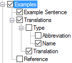

# Examples

*User Interface › Menus › Tools › Configure Dictionary*

In the [left pane](About_the_left_pane.md), **Examples** appears under each **Senses** node, but only under some of the **Subsenses** nodes. **See:** [Senses/Subsenses](Senses_Subsenses.md).

<table width="100%">
<tbody>
<tr style="height: 20px;">
<th>
<strong>Example</strong>
</th>
<th>
<strong>Description/Content Sources</strong>
</th>
</tr>
&#10;<tr style="height: 207px;">
<td>

</td>
<td>
If selected (), contents from these fields are displayed:

<strong>Examples</strong>:

<ul>
<li>
<strong>Example Sentence</strong>: <a href="../../../Field_Descriptions/Lexicon/Lexicon_Edit_fields/Sense_level_fields/example_field.md">Example</a> field
</li>
<li>
<strong>Translations</strong>: <a href="../../../Field_Descriptions/Lexicon/Lexicon_Edit_fields/Sense_level_fields/Type_field.md">Type</a> field (<a href="../../../Field_Descriptions/Lists/Translation_Types_fields/Abbreviation_field_Translation_Types.md">Abbreviation</a>, <a href="../../../Field_Descriptions/Lists/Translation_Types_fields/Name_field_Translation_Types.md">Name</a>, or both) and <a href="../../../Field_Descriptions/Lexicon/Lexicon_Edit_fields/Sense_level_fields/Translation_field.md">Translation</a> field
</li>
<li>
<strong>Reference</strong>: <a href="../../../Field_Descriptions/Lexicon/Lexicon_Edit_fields/Sense_level_fields/Reference_field.md">Reference</a> field
</li>
</ul>

In some cases, you see the <strong>Display each Example in a separate paragraph</strong> check box in the right pane.

<ul>
<li>
If selected (), the <strong>Paragraph Style for Content</strong> control are shown.
</li>
</ul>

The <strong>Bulleted List</strong> <a href="../../../../Basic_Tasks/Formatting_Text/Formatting_Text_overview.md">style</a> is set by default, but you can use other paragraphs styles () for examples set in separate paragraphs.

<ul>
<li>
If cleared (), the <strong>Character Style for Content</strong> controls are shown.
</li>
</ul></td>
</tr>
</tbody>
</table>

> [!NOTE]
>
> - **Examples** also appear in other places, such as with [Referenced Complex Forms](Referenced_Complex_Forms.md).
>
> - A different instance of **Examples** appears with [Extended Note](Extended_Note.md).

## Related topics
[Abbreviation and Name](abbreviation_and_name.md)

<a href="Configure_Dictionary.md" style="font-weight: normal;">Configure Dictionary dialog box</a>

[Example field](../../../Field_Descriptions/Lexicon/Lexicon_Edit_fields/Sense_level_fields/example_field.md)

[Find example sentence](../../../../Using_Tools/Lexicon_tools/Lexicon_Edit/Find_example_sentence.md)
