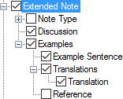

# Extended Note

*User Interface › Menus › Tools › Configure Dictionary*

In the [left pane](About_the_left_pane.md), **Extended Note** appears in each **Sense** node, but only under some of the **Subsenses** nodes. **See:** [Senses/Subsenses](Senses_Subsenses.md).

<table width="100%">
<tbody>
<tr>
<th>
<strong>Example</strong>
</th>
<th>
<strong>Content Sources</strong>
</th>
</tr>
&#10;<tr>
<td>

</td>
<td>
If selected (), contents from these fields are displayed:

<strong>Extended Note</strong>:

<ul>
<li>
<strong>Note Type</strong>: <a href="../../../Field_Descriptions/Lists/Extended_Note_Types/Abbreviation_field_Extended_Notes.md">Abbreviation</a>, <a href="../../../Field_Descriptions/Lists/Extended_Note_Types/Name_field_Extended_Notes.md">Name</a> or both from the <strong>Extended Note Types</strong> <a href="../../../../Using_Tools/Lists_tools/List_item_usage_table.md">list</a>. 
(<strong>See Also</strong>: <strong> </strong><a href="../../../Field_Descriptions/Lexicon/Lexicon_Edit_fields/Sense_level_fields/Extended_Note/Type_field_(Extended_Note).md">Type</a> field)
</li>
<li>
<strong>Discussion</strong>: <a href="../../../Field_Descriptions/Lexicon/Lexicon_Edit_fields/Sense_level_fields/Extended_Note/Discussion_field_(Extended_Note).md">Discussion</a> field
</li>
<li>
<strong>Examples</strong>:
</li>
<li><ul>
<li>
<strong>Example Sentences</strong>: <a href="../../../Field_Descriptions/Lexicon/Lexicon_Edit_fields/Sense_level_fields/Extended_Note/Example_field_(Extended_Note).md">Example</a> field
</li>
<li>
<strong>Translation(s)</strong>: <a href="../../../Field_Descriptions/Lexicon/Lexicon_Edit_fields/Sense_level_fields/Extended_Note/Translation_field_(Extended_Note).md">Translation</a> field.
</li>
<li>
<strong>Reference</strong>: similar to what you see in a <a href="../../../Field_Descriptions/Lexicon/Lexicon_Edit_fields/Sense_level_fields/Reference_field.md">Reference</a> field, which is the title of a <a href="../../../Field_Descriptions/Texts_%26_Words/Title_field_Info.md">text</a>. It is used only if you used <a href="../../../../Using_Tools/Lexicon_tools/Lexicon_Edit/Find_example_sentence.md">Find Example Sentence</a>.
</li>
</ul></li>
</ul>

Currently, the <strong>Reference</strong> field is <em>not</em> included in the <strong>Extended Note</strong> field set. However, you can see the reference in <strong>Dictionary</strong> even if not in the field set.
</td>
</tr>
</tbody>
</table>

> [!TIP]
>
> - If you need to have different begin/end punctuation for different extended note [types](../../../Field_Descriptions/Lexicon/Lexicon_Edit_fields/Sense_level_fields/Extended_Note/Type_field_(Extended_Note).md), you can do this by [duplicating](Duplicate_Dict_field.md) the **Extended Note** node. **See:** [Extended Note fields overview](../../../Field_Descriptions/Lexicon/Lexicon_Edit_fields/Sense_level_fields/Extended_Note/Extended_Note_fields_overview.md) and [Extended Note field](../../../Field_Descriptions/Lexicon/Lexicon_Edit_fields/Sense_level_fields/Extended_Note/Extended_Note_field.md).

## Related topics
<a href="Configure_Dictionary.md" style="font-weight: normal;">Configure Dictionary dialog box</a>

[Insert an extended note](../../../../Using_Tools/Lexicon_tools/Lexicon_Edit/Insert_an_extended_note.md)

[Insert an example in an extended note](../../../../Using_Tools/Lexicon_tools/Lexicon_Edit/Insert_an_example_in_extended_note.md)

[Extended Note field](../../../Field_Descriptions/Lexicon/Lexicon_Edit_fields/Sense_level_fields/Extended_Note/Extended_Note_field.md)

[Examples](Examples.md)
