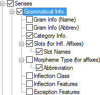

# Grammatical Info

*User Interface › Menus › Tools › Configure Dictionary*

In the [left pane](About_the_left_pane.md) of the **Configure Dictionary** **dialog box**, **Grammatical Info** appears under each **Senses** node, but only under some of the **Subsenses** nodes. **See:** [Senses/Subsenses](Senses_Subsenses.md).

<table>
<tbody>
<tr>
<th>
<strong>Example</strong>
</th>
<th>
<strong>Description</strong>
</th>
</tr>
&#10;<tr>
<td>
<strong></strong>
</td>
<td>
<em>Right pane:</em>

<strong>If all senses share the grammatical information, show it first</strong> check box:

<ul>
<li>
If selected (), for any entry for which each sense has the <em>same</em> grammatical info, the category appears ahead of the first sense (<code>headword</code> n 1. definition 2. definition).
</li>
<li>
If cleared (), the display of each sense includes the grammatical info (<code>headword</code> 1. n definition 2. n definition).
</li>
</ul></td>
</tr>
<tr>
<td colspan="2">
<em>Left pane:</em>

The <strong>Grammatical Info</strong> node allows you to configure the following content in the dictionary:

<ul>
<li>
<strong>Gram Info (Name)</strong>
</li>
</ul>

For each sense, the <a href="../../../Field_Descriptions/Grammar/Category_Edit_fields/rlt1edc.md">name</a> of the grammatical category (<a href="../../../../Using_Tools/Grammar_tools/Category_Edit/Category_Edit_overview.md">Grammar</a>).

<ul>
<li>
<strong>Gram Info (Abbrev)</strong>
</li>
</ul>

For each sense, the <a href="../../../Field_Descriptions/Grammar/Category_Edit_fields/abbreviation_field_category_category_edit.md">abbreviation</a> of the name of the grammatical category (<a href="../../../../Using_Tools/Grammar_tools/Category_Edit/Category_Edit_overview.md">Grammar</a>).

<ul>
<li>
<strong>Category Info</strong>

Source: <a href="../../../Field_Descriptions/Grammar/Category_Edit_fields/abbreviation_field_category_category_edit.md">Abbreviation</a> field (<a href="../../../../Using_Tools/Grammar_tools/Category_Edit/Category_Edit_overview.md">Grammar</a>), as used in the <a href="../../../Field_Descriptions/Lexicon/Lexicon_Edit_fields/Sense_level_fields/Grammatical_Info_field.md">Grammatical Info</a> field for each sense and its <a href="../../../Field_Descriptions/Lexicon/Lexicon_Edit_fields/Grammatical_Info_Details_fields/Category_Info_field.md">Category Info</a> field.
</li>
<li>
<strong>Slots (for Infl Affixes)</strong> and <strong>Slot Names</strong>

Source: <a href="../../../Field_Descriptions/Grammar/Category_Edit_fields/name_field_slot_category_edit.md">Slot Name</a> field (<a href="../../../../Using_Tools/Grammar_tools/Category_Edit/Category_Edit_overview.md">Grammar</a>), as used in the <a href="../../../Field_Descriptions/Lexicon/Lexicon_Edit_fields/Sense_level_fields/Grammatical_Info_field.md">Grammatical Info</a> field and <a href="../../../Field_Descriptions/Lexicon/Lexicon_Edit_fields/Grammatical_Info_Details_fields/Slots_field.md">Slots</a> field.
</li>
<li>
<strong>Morpheme Type (for affixes)</strong>
</li>
</ul>

Source: <a href="../../../Field_Descriptions/Lexicon/Lexicon_Edit_fields/Entry_level_fields/Morph_Type_Field.md">Morph Type</a> field

<ul>
<li>
<strong>Inflection Class</strong>

Source: <a href="../../../Field_Descriptions/Grammar/Category_Edit_fields/abbreviation_field_inflection_class_category_edit.md">Abbreviation</a> field for the inflection class (<a href="../../../../Using_Tools/Grammar_tools/Category_Edit/Category_Edit_overview.md">Grammar</a>), as used in the <a href="../../../Field_Descriptions/Lexicon/Lexicon_Edit_fields/Sense_level_fields/Grammatical_Info_field.md">Grammatical Info</a> field. (Its full name appears in any of the various <strong>Inflection Class</strong> fields, under <a href="../../../Field_Descriptions/Lexicon/Lexicon_Edit_fields/Grammatical_Info_Details_fields/Gram_Info_Detls_fields_ovw.md">Grammatical Info Details</a>).
</li>
<li>
<strong>Inflection Features</strong>

Source: As used in the various <strong>Inflection Features</strong> fields (under <a href="../../../Field_Descriptions/Lexicon/Lexicon_Edit_fields/Grammatical_Info_Details_fields/Gram_Info_Detls_fields_ovw.md">Grammatical Info Details</a>):

<ul>
<li>
<a href="../../../Field_Descriptions/Grammar/Inflection_Features_fields/abbreviation_field_feature_features.md">Abbreviation</a> fields for the <a href="../../../Field_Descriptions/Grammar/Inflection_Features_fields/Features_fields_overview.md">inflection features</a> (<em>not</em> complex).
</li>
<li>
<a href="../../../Field_Descriptions/Grammar/Inflection_Features_fields/abbreviation_field_feature_features.md">Abbreviation</a> fields for feature values (<em>complex</em> feature).
</li>
</ul></li>
<li>
<strong>Exception Features</strong>
</li>
</ul>

Source: <a href="../../../Field_Descriptions/Grammar/Exception_Features_fields/abbreviation_field_exception_features.md">Abbreviation</a> fields for exception “features.” Associated full names appear in any of the various <strong>Exception</strong> <strong>“Features”</strong> fields (<a href="../../../Field_Descriptions/Lexicon/Lexicon_Edit_fields/Grammatical_Info_Details_fields/Gram_Info_Detls_fields_ovw.md">Grammatical Info Details</a>).
</td>
</tr>
</tbody>
</table>

## Related topics
<a href="Configure_Dictionary.md" style="font-weight: normal;">Configure Dictionary dialog box</a>

[Grammatical Info Details fields overview](../../../Field_Descriptions/Lexicon/Lexicon_Edit_fields/Grammatical_Info_Details_fields/Gram_Info_Detls_fields_ovw.md)

[Show Abbreviation as its label](../../../Field_Descriptions/Grammar/Inflection_Features_fields/Show_Abbr_as_label_field_Features.md) (**Features**)

[Style example](Style_example.md)
