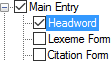
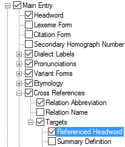
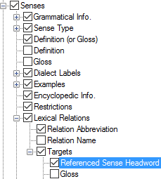

# Headword

*User Interface › Menus › Tools › Configure Dictionary*

In the [left pane](About_the_left_pane.md), **Headword** appears under **Main Entry**, **Minor Entry (Complex Form)**, **Minor Entry (Variants)** and **Subentries**.

<table>
<tbody>
<tr>
<th>
<strong>Example</strong>
</th>
<th>
<strong>Description</strong>
</th>
</tr>
&#10;<tr>
<td>
<strong></strong>
</td>
<td>
<strong>Headword</strong> controls the appearance of content from the <a href="../../../Field_Descriptions/Lexicon/Lexicon_Edit_fields/Entry_level_fields/Citation_Form_field.md">Citation Form</a> field, if any. Otherwise, content from the <a href="../../../Field_Descriptions/Lexicon/Lexicon_Edit_fields/Entry_level_fields/Lexeme_Form_field.md">Lexeme Form</a> field is used.

In the <em>right</em> pane, you can select () the specific vernacular writing systems you want to use (<em>optional</em>). If you select more than one, you can select () the <strong>Display Writing System Abbreviation</strong>.
</td>
</tr>
</tbody>
</table>

- You can separately configure the display of headwords and headword references under other items, such as a **Variant Form** ([Variant Forms](Variant_Forms.md)).

Here are two other examples:

<table width="100%">
<tbody>
<tr>
<th>
<strong>Referenced Headword</strong> 
(<a href="Cross_References.md">Cross References</a>)
</th>
<th>
<strong>Referenced Sense Headword</strong> 
(<a href="Lexical_Relations.md">Lexical Relations</a>)
</th>
</tr>
&#10;<tr>
<td>

</td>
<td>

</td>
</tr>
</tbody>
</table>

> [!IMPORTANT]
>
> - A "headword" consists of the lexeme form or citation form plus any homograph number. In addition, for a *referenced* headword, it can also include the sense number if a specific sense was [chosen](../../../../Using_Tools/Lexicon_tools/Lexicon_Edit/Choose_components_for_Components_field.md).

## Related topics
[Allomorphs](alternate_forms.md)

<a href="Configure_Dictionary.md" style="font-weight: normal;">Configure Dictionary dialog box</a>

[Configure Headword Numbers dialog box](../Configure_Headword_Numbers/Config_Hdwrd_Numbers_dialog_box.md)

[Exclude an entry from the dictionary](../../../../Using_Tools/Lexicon_tools/Lexicon_Edit/Exclude_an_entry_from_the_dictionary.md)

[Show As Headword In field](../../../Field_Descriptions/Lexicon/Lexicon_Edit_fields/Publication_Settings_flds/Show_As_Headword_In_field.md)

[Variant Forms](Variant_Forms.md)
