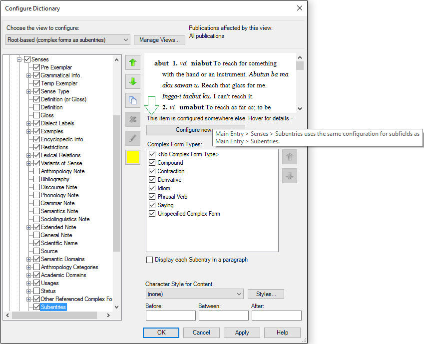
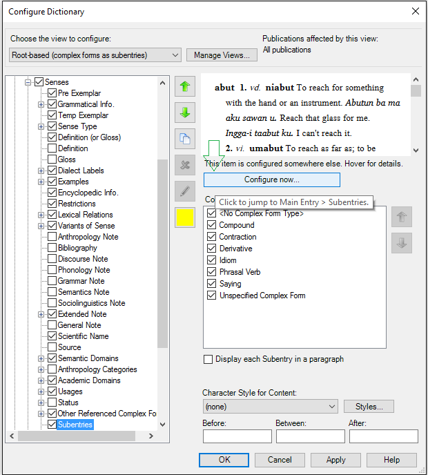
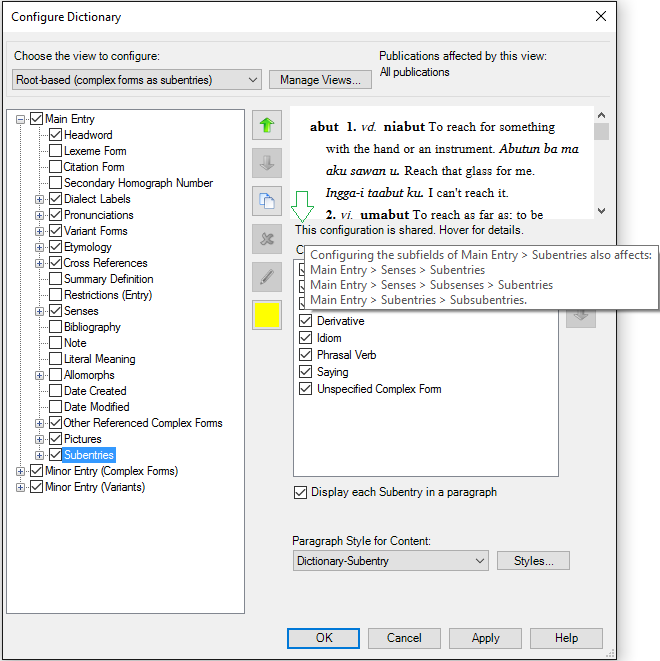

# Hover for details examples

*User Interface › Menus › Tools › Configure Dictionary*

When you [configure](Using_the_Configure_Dictionary_dialog_box.md) a [dictionary view](Dictionary_views.md), either of these statements can appear in the *right* pane:

- **This item is configured somewhere else. Hover for details**.

In this case you also see a **Configure now** button.

- **This configuration is shared. Hover for details**.

If you see either of these statements, you are looking at a *shared* field or node (item).

Hold your mouse pointer over any part of a statement to see a pop-up box. It informs you of the node where the current one is configured, *or* it lists fields or nodes that are affected by the configuration of the current node.

Hold your mouse pointer over a **Configure now** button to see which item will be in focus if you click that button.

Be aware that each item listed in the pop-up box may have additional configuration controls that you can use. So if the [right-click feature](../../../../Using_Tools/Lexicon_tools/Dictionary/Use_right-click_to_help_configure_Dictionary_view.md) brought you to a shared item, you may need to also examine each of the items listed in the pop-up box to identify where else you can look for configuration controls.

## Examples

## Related topics
<a href="Configure_Dictionary.md" style="font-weight: normal;">Configure Dictionary dialog box</a>

[Duplicate a field (Dictionary)](Duplicate_Dict_field.md)

[Main Entry and Minor Entry](Main_Minor_entry.md)
