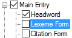

# Lexeme Form

*User Interface › Menus › Tools › Configure Dictionary*

In the [left pane](About_the_left_pane.md), **Lexeme Form** appears under **Main** **Entry**, **Minor Entry (Complex Form)**, **Minor Entry (Variants)** and **Subentries**.

<table>
<tbody>
<tr>
<th>
<strong>Example</strong>
</th>
<th>
<strong>Description</strong>
</th>
</tr>
&#10;<tr>
<td>

</td>
<td>
This controls the appearance of content from the <a href="../../../Field_Descriptions/Lexicon/Lexicon_Edit_fields/Entry_level_fields/Lexeme_Form_field.md">Lexeme Form</a> field.

If you select () both <strong>Lexeme Form</strong> and <a href="Headword.md">Headword</a>, then entries with <em>no</em> content in the <strong>Citation Form</strong> field will contain the lexeme form <em>twice</em>. However, each is independently configurable, so you can specify different writing systems, styles, and surrounding context.
</td>
</tr>
</tbody>
</table>

## Related topics
<a href="Configure_Dictionary.md" style="font-weight: normal;">Configure Dictionary dialog box</a>

[Swap Lexeme Form with Allomorph](../../../../Using_Tools/Lexicon_tools/Lexicon_Edit/Swap_LexForm_with_Allomorph.md)
