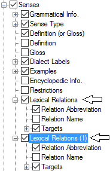
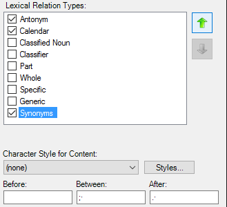

# Lexical Relation Types example

*User Interface › Menus › Tools › Configure Dictionary*

In the [left pane](About_the_left_pane.md), **Lexical Relations** appears under each **Senses** node, but only under some of the **Subsenses** nodes. **See:** [Senses/Subsenses](Senses_Subsenses.md).

When **Lexical Relations** is in focus (highlighted), the right pane lists the lexical relation types that are currently available in the language project.

- You can reorder the lexical relation types using the up arrow or down arrow in the *right* pane.

- In the *left* pane, you can [duplicate](Duplicate_Dict_field.md) the **Lexical Relations** node one or more times. **(1)**, **(2)** and so on is appended to the label for copies. Then, in each instance you can do any of these or more:

  - select () different lexical relations

  - choose different character styles for content

  - add custom surrounding content

  - in the *left* pane, reorder the different **Lexical Relations** field sets with the  (**Move Up**) or  (**Move Down**) in the *left* pane. Then, the lexical relations will appear in different locations in **Dictionary**.

|  |  |
|----|----|
| **Left pane (***Duplicated* **'Lexical Relations' highlighted)** | **Right pane** |
|  |  |

## Related topics
<a href="Configure_Dictionary.md" style="font-weight: normal;">Configure Dictionary dialog box</a>

[Lexical Relations](Lexical_Relations.md)
