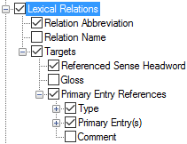

# Lexical Relations

*User Interface › Menus › Tools › Configure Dictionary*

In the [left pane](About_the_left_pane.md), **Lexical Relations** appears under each **Senses** node, but only under some of the **Subsenses** nodes. **See:** [Senses/Subsenses](Senses_Subsenses.md).

<table width="100%">
<tbody>
<tr>
<th>
<strong>Example</strong>
</th>
<th>
<strong>Description/Content Sources</strong>
</th>
</tr>
&#10;<tr>
<td>

</td>
<td><ul>
<li>
Below <strong>Lexical Relation Types</strong> (<em>right</em> pane), select () each lexical relation type that you want to display. Optionally, you can do the following:
</li>
<li><ul>
<li>
Use the up arrow or down arrow to reorder the selected types (<em>right</em> pane).
</li>
<li>
In the <em>left</em> pane, <a href="Duplicate_Dict_field.md">duplicate</a> <strong>Lexical Relations</strong>, and then select different lexical relation types to display in each instance.
</li>
<li>
Use up arrow or down arrow to reorder the instances (<em>left</em> pane).
</li>
</ul></li>
</ul></td>
</tr>
<tr>
<td colspan="2">
For senses that have <a href="../../../../Using_Tools/Lexicon_tools/Lexicon_Edit/Insert_a_lexical_relation.md">lexical relations</a> (such as <a href="../../../../Using_Tools/Lists_tools/About_Lexical_Relations.md">Antonym</a>), you can configure the display any of the corresponding information:

<ul>
<li>
<strong>Relation Abbreviation</strong>: <a href="../../../Field_Descriptions/Lists/Lexical_Relations_fields/abbreviation_field_lexical_relations.md">Abbreviation</a> or <a href="../../../Field_Descriptions/Lists/Lexical_Relations_fields/reverse_abbreviation_field_lexical_relations.md">Reverse Abbreviation</a> field from the <strong>Lexical Relations</strong> <a href="../../../../Using_Tools/Lists_tools/List_item_usage_table.md">list</a>
</li>
<li>
<strong>Relation Name</strong>: <a href="../../../Field_Descriptions/Lists/Lexical_Relations_fields/name_field_lexical_relations.md">Name</a> or <a href="../../../Field_Descriptions/Lists/Lexical_Relations_fields/reverse_name_field_lexical_relations.md">Reverse Name</a> field from the <strong>Lexical Relations</strong> list
</li>
<li>
<strong>Targets</strong>: <a href="Headword.md">Referenced Sense Headword</a> and <a href="gloss.md">Gloss</a>
</li>
<li>
<strong>Primary Entry References</strong>:
</li>
<li><ul>
<li>
<strong>Type:</strong> <a href="../../../Field_Descriptions/Lists/Complex_Form_Types_flds/reverse_abbr_fld_(complex_fm_types).md">Reverse Abbreviation</a> or <a href="../../../Field_Descriptions/Lists/Complex_Form_Types_flds/Reverse_Name_field_(Complex_Form_Types).md">Reverse Name</a> from the <strong>Complex Form Types</strong> <a href="../../../Field_Descriptions/Lists/Complex_Form_Types_flds/complex_fm_types_flds_overview.md">list</a> as selected in the <a href="../../../Field_Descriptions/Lexicon/Lexicon_Edit_fields/Entry_level_fields/Complex_Form_Type_field.md">Complex Form Type</a> field in the referenced complex entry, <em>or</em> <a href="../../../Field_Descriptions/Lists/Variant_Types_flds/Reverse_Abbr_fld_Variant_Types.md">Reverse Abbreviation</a> or <a href="../../../Field_Descriptions/Lists/Variant_Types_flds/Reverse_Name_field_(Variant_Types).md">Reverse Name</a> from the <strong>Variant Types</strong> <a href="../../../Field_Descriptions/Lists/Variant_Types_flds/variant_types_flds_overview.md">list</a> as selected in the <a href="../../../Field_Descriptions/Lexicon/Lexicon_Edit_fields/Entry_level_fields/Variant_Type_field.md">Variant Type</a> field in the referenced variant entry.
</li>
<li>
<strong>Referenced Headword</strong>: the headword (<a href="../../../Field_Descriptions/Lexicon/Lexicon_Edit_fields/Entry_level_fields/Lexeme_Form_field.md">lexeme</a> or <a href="../../../Field_Descriptions/Lexicon/Lexicon_Edit_fields/Entry_level_fields/Citation_Form_field.md">citation</a> form) of the referenced complex form or variant entry.
</li>
<li>
<strong>Gloss (or Summary Definition)</strong>: the <a href="../../../Field_Descriptions/Lexicon/Lexicon_Edit_fields/Sense_level_fields/Gloss_field_Sense.md">gloss</a> from the chosen sense when <strong>Specific Sense</strong> is selected. If there is no gloss, then the <a href="../../../Field_Descriptions/Lexicon/Lexicon_Edit_fields/Entry_level_fields/Summary_Definition_field.md">Summary Definition</a> field from the referenced entry.
</li>
<li>
<strong>Comment</strong>: <a href="../../../Field_Descriptions/Lexicon/Lexicon_Edit_fields/Entry_level_fields/Comment_field.md">Comment</a> field associated with the <strong>Complex Form Type</strong> field, or with the <strong>Variant Type</strong> field.
</li>
</ul></li>
</ul></td>
</tr>
</tbody>
</table>

> [!NOTE]
>
> - **P****rimary Entry References** allows references to variants or complex forms to display the main entry of the referenced form.

## Related topics
[Abbreviation and Name](abbreviation_and_name.md)

<a href="Configure_Dictionary.md" style="font-weight: normal;">Configure Dictionary dialog box</a>

[Lexical Relation Types - example](Lexical_Relation_Types_example.md)

[Lexical Relations field](../../../Field_Descriptions/Lexicon/Lexicon_Edit_fields/Sense_level_fields/lexical_relations_field.md)

[Writing Systems](Writing_Systems.md)
