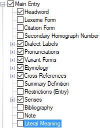

# Literal Meaning

*User Interface › Menus › Tools › Configure Dictionary*

In the [left pane](About_the_left_pane.md), **Literal Meaning** appears under **Main** **Entry**, **Minor Entry (Complex Forms)**, **Minor Entry (Variants)** and **Subentries**.

<table width="100%">
<tbody>
<tr>
<th>
<strong>Example</strong>
</th>
<th>
<strong>Description/Data</strong> Sources
</th>
</tr>
&#10;<tr>
<td>

</td>
<td>
If selected (), content from the <strong>Literal Meaning</strong> field is displayed.

This field is <em>different</em> from the <strong>Summary Definition</strong> field and <strong>Summary Definition</strong> (which is used with multiple items in the <strong>Configure Dictionary View</strong> dialog box, such as under <a href="Referenced_Complex_Forms.md">Referenced Complex Forms</a>).
</td>
</tr>
</tbody>
</table>

## Related topics
<a href="Configure_Dictionary.md" style="font-weight: normal;">Configure Dictionary dialog box</a>

[Literal Meaning field](../../../Field_Descriptions/Lexicon/Lexicon_Edit_fields/Entry_level_fields/Literal_Meaning_field.md)

[Summary Definition field](../../../Field_Descriptions/Lexicon/Lexicon_Edit_fields/Entry_level_fields/Summary_Definition_field.md)
