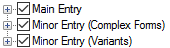
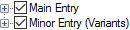

# Main Entry and Minor Entry

*User Interface › Menus › Tools › Configure Dictionary*

- A "main entry" is an entry in a published dictionary that alphabetizes under its headword and *fully* describes the headword.

- A "minor entry" is a short entry that refers the user to another entry where there is a full description of the headword.\
  For example, when you [insert a variant form](../../../../Using_Tools/Lexicon_tools/Lexicon_Edit/Insert_a_variant_form.md) it is added without a [sense](../../../Field_Descriptions/Lexicon/Lexicon_Edit_fields/Sense_level_fields/Sense_level_fields_overview.md).

In the [left pane](About_the_left_pane.md) of the **Configure Dictionary** dialog box, [layouts](Dictionary_views.md) have two or three top-level nodes (). As shown in the tables below, [variants](../../../../Using_Tools/Lists_tools/About_Variants.md) are *minor* entries in each of the layouts, but [complex forms](../../../../Using_Tools/Lists_tools/About_complex_forms.md) may be main *or* minor entries, or [subentries](../../../../Using_Tools/Lexicon_tools/Lexicon_Edit/Add_a_lexical_subentry.md).

Here is a brief overview of what you see when you click  to expand nodes.

<table width="100%">
<tbody>
<tr>
<th>
<strong>Root-based</strong>
</th>
<th>
<strong>You see:</strong>
</th>
</tr>
&#10;<tr>
<td>

</td>
<td><ul>
<li>
<strong>Main</strong> <strong>Entry</strong>: fields that specify the content of the main entries.
</li>
</ul>

This includes any <a href="Variant_Forms.md">variant forms</a>, <a href="Other_Referenced_Complex_Forms.md">other referenced complex forms</a> and <a href="Subentries.md">subentries</a> that can appear in and below the main entry.

<ul>
<li>
<strong>Minor Entry (Complex Forms)</strong>: fields that control the content of <a href="Complex_Forms.md">complex forms</a> that are displayed as <em>minor</em> entries.
</li>
<li>
<strong>Minor Entry (Variants)</strong>: fields that control the content of variants that are displayed as <em>minor</em> entries.
</li>
</ul></td>
</tr>
</tbody>
</table>

<table width="100%">
<tbody>
<tr>
<th>
<strong>Lexeme-based</strong>
</th>
<th>
<strong>You see:</strong>
</th>
</tr>
&#10;<tr>
<td>

</td>
<td><ul>
<li>
<strong>Main</strong> <strong>Entry</strong>: fields that specify the content of the main entries.
</li>
</ul>

This includes any <a href="Variant_Forms.md">variant forms</a>, <a href="Complex_Forms.md">complex forms</a> and <a href="Referenced_Complex_Forms.md">referenced complex forms</a> that appear in and below the main entry.

<ul>
<li>
<strong>Minor Entry (Variants)</strong>: fields that control the content of variants that are displayed as <em>minor</em> entries.
</li>
</ul></td>
</tr>
</tbody>
</table>

<table width="100%">
<tbody>
<tr>
<th>
<strong>Hybrid</strong>
</th>
<th>
<strong>You see:</strong>
</th>
</tr>
&#10;<tr>
<td>

</td>
<td><ul>
<li>
<strong>Main</strong> <strong>Entry</strong>: fields that specify the content of the main entries.
</li>
</ul>

This includes any <a href="Complex_Forms.md">complex forms</a>, <a href="Other_Referenced_Complex_Forms.md">other referenced complex forms</a> and <a href="Variant_Forms_(Inflectional_Variants).md">variant form (Infl. variants)</a> that appear in and below the main entry. This includes <a href="Minor_Subentries_(Hybrid_view).md">minor subentries</a>.

<strong>See Also:</strong> <a href="References_Section_(Config._Dict.).md">[References Section]</a>.

<ul>
<li>
<strong>Minor Entry (Variants)</strong>: fields that control the content of variants that are displayed as <em>minor</em> entries.
</li>
</ul></td>
</tr>
</tbody>
</table>

## Related topics
[About the Hybrid Dictionary layout](About_the_Hybrid_Dictionary_view.md)

[Complex Forms](Complex_Forms.md)

[Configure Dictionary dialog box](Configure_Dictionary.md)

[Dictionary layouts](Dictionary_views.md)

[Free Variant](../../../Field_Descriptions/Lists/Variant_Types_flds/Free_Variant.md)

[Irregularly Inflected Form](../../../Field_Descriptions/Lists/Variant_Types_flds/Irregularly_Inflected_Form.md)
