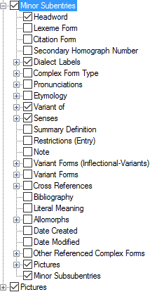

# Minor Subentries (Hybrid layout)

*User Interface › Menus › Tools › Configure Dictionary*

[Hybrid](About_the_Hybrid_Dictionary_view.md) layouts only.

In the [left pane](About_the_left_pane.md), **Minor Subentries** appears under **Main Entry**.

Subentries in hybrid layout typically contain *less* information than [subentries](Subentries.md) in [root-based](Dictionary_views.md) layouts. However, the available fields and nodes () are essentially the same.

<table width="100%">
<tbody>
<tr>
<th>
<strong>Example - Main Entry</strong>
</th>
<th>
Note
</th>
</tr>
&#10;<tr>
<td>

</td>
<td>
Set the order by complex form <em>type</em> in the <em>right</em> pane using the up arrow and down arrow.

Set the order of subentries in the <a href="../../../Field_Descriptions/Lexicon/Lexicon_Edit_fields/Publication_Settings_flds/Subentries_(Publication_Settings).md">Subentries</a> field (<strong>Publication Settings</strong>) and <a href="../../../Field_Descriptions/Lexicon/Lexicon_Edit_fields/Sense_level_fields/Subentries_(Sense).md">Subentries</a> field (<strong>Senses</strong>).
</td>
</tr>
</tbody>
</table>

> [!IMPORTANT]
>
> - If the complex form is displayed in the [Subentries field](../../../Field_Descriptions/Lexicon/Lexicon_Edit_fields/Publication_Settings_flds/Subentries_(Publication_Settings).md), then it is a *minor subentry*; if not, then it is an *other referenced complex form*.
>
> So, an entry that is a complex form is configured either by the **Minor Subentries** node or **Other Referenced Complex Form** node.
>
> - **Minor Subsubentries** inherits the configuration set in the **Minor Subentries** node.
>
> You may see one of these statements in the right pane:
>
> - **This configuration is shared. Hover for details.**
>
> - **This item is configured somewhere else. Hover for details.**
>
> <!-- -->
>
> - **See Also:** [Hover for details - examples](Hover_for_details_example.md) and [Complex Forms](Complex_Forms.md).

## Related topics
[Add a lexical subentry](../../../../Using_Tools/Lexicon_tools/Lexicon_Edit/Add_a_lexical_subentry.md)

<a href="Configure_Dictionary.md" style="font-weight: normal;">Configure Dictionary dialog box</a>

[Duplicate a field (Dictionary)](Duplicate_Dict_field.md)

[Main Entry and Minor Entry](Main_Minor_entry.md)
