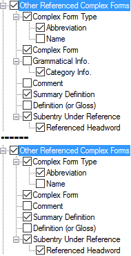

# Other Referenced Complex Forms

*User Interface › Menus › Tools › Configure Dictionary*

*Other referenced complex forms* are those forms that are in the [Referenced Complex Forms](../../../Field_Descriptions/Lexicon/Lexicon_Edit_fields/Publication_Settings_flds/Referenced_Complex_Forms_Publication_Settings.md) field, but which are *not* *also* in the [Subentries](../../../Field_Descriptions/Lexicon/Lexicon_Edit_fields/Publication_Settings_flds/Subentries_(Publication_Settings).md) field.

They can appear in the dictionary entry, but *not* as indented [subentries](Subentries.md).

For *Root*-based [layouts](Dictionary_views.md), **Other Referenced Complex Forms** appears in the [left pane](About_the_left_pane.md) below **Main Entry****.**

For *Hybrid* layouts, see [\[References Section\]](References_Section_(Config._Dict.).md).

- In the *right* pane, select () each complex form type you want to display.

Optionally, you can do the following:

1.  - In the *left* pane, you can [duplicate](Duplicate_Dict_field.md) **Other Referenced Complex Forms**. Then, select different complex form types to display in each instance.

    - Use up arrows or down arrows to reorder the instances (*left* pane), or types (*right* pane).

<table width="100%">
<tbody>
<tr style="height: 24px;">
<th>
<strong>Examples</strong>
</th>
<th>
Content Sources
</th>
</tr>
&#10;<tr style="height: 222px;">
<td>

</td>
<td>
If selected (), contents from these fields are displayed:

<strong>Other Referenced Complex Forms</strong>

<ul>
<li>
<strong>Complex Form Type</strong>: <a href="../../../Field_Descriptions/Lists/Complex_Form_Types_flds/abbr_fld_(complex_fm_types).md">Abbreviation</a> or <a href="../../../Field_Descriptions/Lists/Complex_Form_Types_flds/name_fld_(complex_fm_types).md">Name</a> field, or both from the <strong>Complex Form Types</strong> <a href="../../../../Using_Tools/Lists_tools/List_item_usage_table.md">list</a>.
</li>
<li>
<strong>Complex Form</strong>: <a href="../../../Field_Descriptions/Lexicon/Lexicon_Edit_fields/Publication_Settings_flds/Referenced_Complex_Forms_Publication_Settings.md">Referenced Complex Forms</a> field
</li>
<li>
<strong>Grammatical Info</strong> (<em>not</em> all instances): 
see <a href="Grammatical_Info.md">Grammatical Info</a>
</li>
<li>
<strong>Comment</strong>: <a href="../../../Field_Descriptions/Lexicon/Lexicon_Edit_fields/Entry_level_fields/Comment_field.md">Comment</a> field
</li>
<li>
<strong>Summary Definition</strong>: <a href="../../../Field_Descriptions/Lexicon/Lexicon_Edit_fields/Entry_level_fields/Summary_Definition_field.md">Summary Definition</a> field
</li>
<li>
<strong>Definition (or Gloss)</strong>: 
see <a href="Definition_or_Gloss.md">Definition (or Gloss)</a>
</li>
<li>
<strong>Subentry Under Reference</strong>
</li>
<li><ul>
<li>
<strong>Referenced Headword</strong>: the headword of the lexical entry or entries that have the complex form in the <a href="../../../Field_Descriptions/Lexicon/Lexicon_Edit_fields/Entry_level_fields/Complex_Forms_entry.md">Complex Forms</a> field.
</li>
</ul></li>
</ul></td>
</tr>
</tbody>
</table>

> [!NOTE]
>
> - **Configure each instance separately.**
>
> - *Lexeme**-based layouts display complex forms as [main entries](Main_Minor_entry.md). Therefore, this node is* *not* *used* for them.
>
> **See Also:** [Complex Forms](Complex_Forms.md).

### *Related Topics*

[Choose Lexical Entry or Sense](../../../../Using_Tools/Lexicon_tools/Lexicon_Edit/Choose_components_for_Components_field.md)

<a href="Configure_Dictionary.md" style="font-weight: normal;">Configure Dictionary dialog box</a>

[Referenced Complex Forms](Referenced_Complex_Forms.md)

[Specify that a form is complex](../../../../Using_Tools/Lexicon_tools/Lexicon_Edit/Specify_that_Form_is_Complex.md)

<a href="../../../../Using_Tools/Lexicon_tools/Dictionary/Use_right-click_to_help_configure_Dictionary_view.md" style="font-style: normal; text-decoration: underline;">Use right-click to help configure Dictionary</a>
