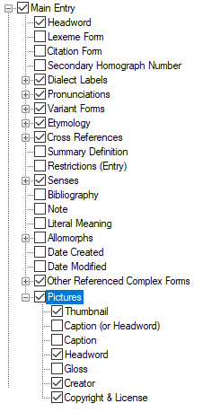

# Pictures

*User Interface › Menus › Tools › Configure Dictionary*

In the [left pane](About_the_left_pane.md), **Pictures** appears under **Main Entry**. For [Hybrid](About_the_Hybrid_Dictionary_view.md) layouts, **Pictures** also appears below **Main Entry**/**Minor Subentries**.

<table width="100%">
<tbody>
<tr>
<th>
<strong>Example (Root-based)</strong>
</th>
<th>
<strong>Description</strong>
</th>
</tr>
&#10;<tr>
<td>

</td>
<td>
If selected (), contents from these fields are displayed:

<ul>
<li>
<strong>Thumbnail</strong> refers to the actual picture as stored in a <a href="../../../Field_Descriptions/Lexicon/Lexicon_Edit_fields/Sense_level_fields/Thumbnail_field.md">Thumbnail</a> field. You can only choose to show or hide it.
</li>
<li>
<strong>Caption (or Headword)</strong> allows you to display content from the <a href="../../../Field_Descriptions/Lexicon/Lexicon_Edit_fields/Sense_level_fields/caption_field.md">Caption</a> field, or the headword if there is not a caption to display.
</li>
<li>
<strong>Caption</strong> allows you to display content from the <a href="../../../Field_Descriptions/Lexicon/Lexicon_Edit_fields/Sense_level_fields/caption_field.md">Caption</a> field. If <strong>Caption (or Headword)</strong> is also selected, duplicate content can appear.
</li>
<li>
<strong>Headword</strong> allows you to display the headword (Lexeme or Citation) of the entry. If <strong>Caption (or Headword)</strong> is also selected, duplicate content can appear.
</li>
<li>
<strong>Gloss</strong> allows you to display content from the <strong>Gloss</strong> <a href="../../../Field_Descriptions/Lexicon/Lexicon_Edit_fields/Sense_level_fields/Gloss_field_Sense.md">field</a>.
</li>
<li>
<strong>Creator</strong> and <strong>Copyright &amp; License</strong> content comes from the <strong>Credit, Copyright and License</strong> <a href="../../../../Using_Tools/Lexicon_tools/Lexicon_Edit/Using_Credit_Copyright_License_dialog_box.md">dialog box</a>. Be aware that Copyright information is required for <a href="../../File/Upload_to_Webonary.md">Webonary</a>.
</li>
</ul>

Some selections allow you to choose one or more writing systems, styles and surrounding context (before or after).

<strong>Document Picture Settings</strong> has controls that help you position pictures for their appearance MS Word™ and other <a href="../../File/Export/Export_overview.md">export</a> destinations.

<ul>
<li>
<strong>Alignment</strong>: You can choose <strong>Left</strong>, <strong>Center</strong> or <strong>Right</strong>.
</li>
<li>
<strong>Max Width (inches)</strong>: Type the maximum width in inches, such as 2.1 or whatever you learn works best for the pictures.
</li>
<li>
<strong>Max Height (inches)</strong>: Type the maximum height in inches, such as 1.1 or whatever you learn works best for the pictures.
</li>
</ul>
<blockquote>

<ul>
<li>
FieldWorks uses the max height and max width as upper bounds on the height and width.
</li>
</ul>

If a picture is <em>smaller </em>than that, nothing happens. It does not increase the size of a picture if its resolution is smaller than the upper bounds given for height/width.

If a picture is <em>bigger</em> than either the max height or width, it is sized down, maintaining aspect ratio, until it satisfies the max height and max width bounds you entered.

</blockquote></td>
</tr>
</tbody>
</table>

## Related topics
**<a href="Configure_Dictionary.md" style="font-weight: normal;">Configure Dictionary dialog box</a>**

[Insert a picture](../../../../Using_Tools/Lexicon_tools/Lexicon_Edit/Insert_a_picture.md)

[Minor Subentries (Hybrid Layout)](Minor_Subentries_(Hybrid_view).md)
