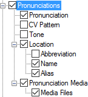
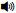

# Pronunciations

*User Interface › Menus › Tools › Configure Dictionary*

In the [left pane](About_the_left_pane.md), **Pronunciations** appears under **Main** **Entry**, **Minor Entry (Complex Forms)**, **Minor Entry (Variants)** and **Subentries**.

<table width="100%">
<tbody>
<tr>
<th>
<strong>Example</strong>
</th>
</tr>
&#10;<tr>
<td>

</td>
</tr>
<tr>
<td>
If selected (), contents from these fields are displayed:

<ul>
<li>
<a href="../../../Field_Descriptions/Lexicon/Lexicon_Edit_fields/Entry_level_fields/Pronunciation_field.md">Pronunciation</a> field
</li>
</ul>

If you have an <em>audio variant</em> of the <a href="../../../../Advanced_Tasks/Writing_Systems/Modifying_a_Writing_System/Using_the_Writing_System_Properties_dialog_box.md">writing system</a>, and <a href="../../../../Basic_Tasks/Audio_files/Audio_files_overview.md">audio recordings</a> of pronunciations, you can choose that audio writing system in the <em>right</em> pane. A play button  is displayed.

<ul>
<li>
<a href="../../../Field_Descriptions/Lexicon/Lexicon_Edit_fields/Entry_level_fields/cv_pattern_field.md">CV Pattern</a> field
</li>
<li>
<a href="../../../Field_Descriptions/Lexicon/Lexicon_Edit_fields/Entry_level_fields/Tone_field.md">Tone</a> field
</li>
<li>
<a href="../../../Field_Descriptions/Lexicon/Lexicon_Edit_fields/Entry_level_fields/Location_field.md">Location</a> field: <a href="../../../Field_Descriptions/Lists/Locations_fields/abbreviation_field_locations.md">abbreviation</a>, <a href="../../../Field_Descriptions/Lists/Locations_fields/location_name_field_locations.md">name</a> and <a href="../../../Field_Descriptions/Lists/Locations_fields/alias_field_locations.md">alias</a> from the <strong>Locations</strong> <a href="../../../../Using_Tools/Lists_tools/List_item_usage_table.md">list</a>.
</li>
<li>
<strong>Pronunciation Media -</strong> You can choose the style or add contents in the <strong>Before</strong>, <strong>Between</strong> or <strong>After</strong> boxes.
</li>
</ul>

If you <a href="../../../../Using_Tools/Lexicon_tools/Lexicon_Edit/Insert_link_to_sound_or_movie.md">inserted</a> a sound or movie file in a pronunciation, select () <strong>Media Files</strong> to display a play button:  (audio),  (video).
</td>
</tr>
<tr>
<td>
<strong> Tip</strong>

<ul>
<li>
<a href="Variant_Forms.md">Variant Forms</a> has a <strong>Variant Pronunciations</strong> field group.
</li>
</ul></td>
</tr>
</tbody>
</table>

## Related topics
[Abbreviation and Name](abbreviation_and_name.md)

**<a href="Configure_Dictionary.md" style="font-weight: normal;">Configure Dictionary dialog box</a>**

[CV Pattern field](../../../Field_Descriptions/Lexicon/Lexicon_Edit_fields/Entry_level_fields/cv_pattern_field.md)

[Location field](../../../Field_Descriptions/Lexicon/Lexicon_Edit_fields/Entry_level_fields/Location_field.md)

[Tone field](../../../Field_Descriptions/Lexicon/Lexicon_Edit_fields/Entry_level_fields/Tone_field.md)

[Pronunciation field](../../../Field_Descriptions/Lexicon/Lexicon_Edit_fields/Entry_level_fields/Pronunciation_field.md)

[Use right-click to help configure Dictionary](../../../../Using_Tools/Lexicon_tools/Dictionary/Use_right-click_to_help_configure_Dictionary_view.md)
