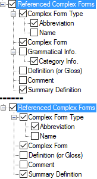

# Referenced Complex Forms (Config. Dict.)

*User Interface › Menus › Tools › Configure Dictionary*

In the [left pane](About_the_left_pane.md), there are multiple instances of **Referenced Complex Forms**.\
**See Also:** [\[References Section\]](References_Section_(Config._Dict.).md).

- In the *right* pane, select () each complex form type you want to display.\
  Optionally, you can do the following:

  - In the *left* pane, you can [duplicate](Duplicate_Dict_field.md) **Referenced Complex Forms**. Then, select different complex form types to display in each instance.

  - Use up arrows or down arrows to reorder the instances (left pane), or selected types (right pane).

<table>
<tbody>
<tr>
<th>
<strong>Examples</strong>
</th>
<th>
<strong>Description/Content Sources</strong>
</th>
</tr>
&#10;<tr>
<td>

</td>
<td>
If selected (), contents from these fields are displayed:

<ul>
<li>
<strong>Complex Form Type</strong>
</li>
<li><ul>
<li>
<a href="../../../Field_Descriptions/Lists/Complex_Form_Types_flds/abbr_fld_(complex_fm_types).md">Abbreviation</a> field
</li>
<li>
<a href="../../../Field_Descriptions/Lists/Complex_Form_Types_flds/name_fld_(complex_fm_types).md">Name</a> field
</li>
</ul></li>
<li>
<strong>Complex Form</strong>: <a href="../../../Field_Descriptions/Lexicon/Lexicon_Edit_fields/Publication_Settings_flds/Referenced_Complex_Forms_Publication_Settings.md">Referenced Complex Forms</a> (<strong>Publication Settings</strong>) or <a href="../../../Field_Descriptions/Lexicon/Lexicon_Edit_fields/Sense_level_fields/Referenced_Complex_Forms_(sense).md">Referenced Complex Forms</a> (<strong>Senses</strong>)
</li>
<li>
<strong>Grammatical Info</strong> (<em>not</em> all instances): 
see <a href="Grammatical_Info.md">Grammatical Info.</a>
</li>
<li>
<strong>Definition (or Gloss)</strong>: 
see <a href="Definition_or_Gloss.md">Definition (or Gloss)</a>
</li>
<li>
<strong>Comment</strong>: <a href="../../../Field_Descriptions/Lexicon/Lexicon_Edit_fields/Entry_level_fields/Comment_field.md">Comment</a> field
</li>
<li>
<strong>Summary Definition</strong>: <a href="../../../Field_Descriptions/Lexicon/Lexicon_Edit_fields/Entry_level_fields/Summary_Definition_field.md">Summary Definition</a> field
</li>
</ul></td>
</tr>
<tr>
<td colspan="2"><blockquote>

<ul>
<li>
<strong><a href="Other_Referenced_Complex_Forms.md">Other Referenced Complex Forms</a> are forms that are in the <a href="../../../Field_Descriptions/Lexicon/Lexicon_Edit_fields/Publication_Settings_flds/Referenced_Complex_Forms_Publication_Settings.md">Referenced Complex Forms</a> field but</strong> <em>not also</em> <strong>in the <a href="../../../Field_Descriptions/Lexicon/Lexicon_Edit_fields/Publication_Settings_flds/Subentries_(Publication_Settings).md">Subentries</a> field.</strong>
</li>
<li>
In some cases, a <strong>Display each Complex Form in a paragraph</strong> check box in the right pane.
</li>
<li><ul>
<li>
If selected (), complex forms appear as main entries and as indented subentries. The subentries typically include <em>minimal</em> data, such as form, category and summary definition. But you can display additional data.
</li>
<li>
This feature works <em>only</em> for complex forms for which the entry, <em>not</em> a specific sense, is <a href="../../../../Using_Tools/Lexicon_tools/Lexicon_Edit/Choose_components_for_Components_field.md">chosen</a> as a component.
</li>
</ul></li>
<li>
<strong>See Also:</strong> <a href="Complex_Forms.md">Complex Forms</a>.
</li>
</ul>
</blockquote></td>
</tr>
</tbody>
</table>

## Related topics
[Choose Lexical Entry or Sense](../../../../Using_Tools/Lexicon_tools/Lexicon_Edit/Choose_components_for_Components_field.md)

[Configure Dictionary dialog box](Configure_Dictionary.md)

[Configure Headword Numbers dialog box](../Configure_Headword_Numbers/Config_Hdwrd_Numbers_dialog_box.md)

[Examples](Examples.md)

[Grammatical Info field](Grammatical_Info.md)

[Specify that a form is complex](../../../../Using_Tools/Lexicon_tools/Lexicon_Edit/Specify_that_Form_is_Complex.md)

[Use right-click to help configure Dictionary](../../../../Using_Tools/Lexicon_tools/Dictionary/Use_right-click_to_help_configure_Dictionary_view.md)
