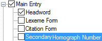

# Secondary Homograph Number

*User Interface › Menus › Tools › Configure Dictionary*

In the [left pane](About_the_left_pane.md), Secondary **Homograph Number** appears under **Main** **Entry**, **Minor Entry (Complex Form)**, **Minor Entry (Variants)** and **Subentries**.

<table width="100%">
<tbody>
<tr>
<th style="width: 25.826%">
<strong>Example</strong>
</th>
<th style="width: 74.174%">
<strong>Description</strong>
</th>
</tr>
&#10;<tr>
<td style="width: 25.826%">

</td>
<td style="width: 74.174%">
If <strong>Secondary Homograph Numbers</strong> is selected (), a secondary set of homograph numbers is added to each entry that has a homograph.

<ul>
<li>
You can move their position in the entry, apply styles and add surrounding content to them.
</li>
<li>
They are automatically updated if you change <a href="../../../Field_Descriptions/Lists/Publications/What_is_a_Publication.md">publications</a> in a <a href="../../../Field_Descriptions/Lexicon/Lexicon_Edit_fields/Publication_Settings_flds/Publish_In_(Publication_Settings).md">Publish Entry In</a> field.
</li>
</ul></td>
</tr>
<tr>
<td colspan="2" style="width: 25.826%">
You use the <a href="../Configure_Headword_Numbers/Config_Hdwrd_Numbers_dialog_box.md">Configure Headword Numbers</a> dialog box to hide or display and configure the <em>default instance</em> of the homograph numbers.
</td>
</tr>
</tbody>
</table>

## Related topics
<a href="Configure_Dictionary.md" style="font-weight: normal;">Configure Dictionary dialog box</a>
