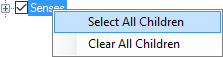
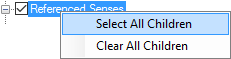

# Select All Children

*User Interface › Menus › Tools › Configure Reversal Index*

Here is something you can do in the [left pane](About_the_left_pane.md) of the **Configure Dictionary** [dialog box.](Configure_Dictionary.md) You can also do these steps in the left pane of the **Configure Reversal Index** [dialog box](../Configure_Reversal_Index/Configure_Reversal_Index_dialog_box.md) or the **Configure Classified Dictionary** [dialog box](../Configure_Classified_Dictionary/Configure_Classified_Dictionary_View_dlgbox.md):

1.  In the layout that you are configuring, click any node ( / ).

2.  Press the `Ctrl` key and `Right-Click` your mouse, and then click one of these commands:

- **Select All Children** to select () *all* the nodes and fields that are subordinate to the node you clicked.

- **Clear All Children** to clear () *all* of the nodes and fields that are subordinate to the node you clicked.

3.  Do one of these steps:

- Examine the results in the dialog box's preview pane, and then click **Cancel** to *not save* any changes.

- Click **Close** to save the changes so you can examine the results in **Dictionary** or in **Reversal Indexes**.

4.  If you saved the changes, `Restore Defaults` on the **Tools** menu does *not* reset these selections.

So, do one of these steps:

- Manually select () or clear () fields and nodes as desired.

- Reset () the layout to factory default. See [Manage Dictionary Layouts](Manage_Dictionary_Views.md) or [Manage Reversal Index Layouts](../Configure_Reversal_Index/Manage_Views_Reversal_Index.md), or [Manage Classified Dictionary Layouts](../Configure_Classified_Dictionary/Manage_Classified_Dictionary_Views.md).

> [!TIP]
>
> - **Dictionary** - 
>
> - **Reversal Index** - 

## Related topics
<a href="Configure_Dictionary.md" style="font-weight: normal;">Configure Dictionary dialog box</a>

[Configure Reversal Index dialog box](../Configure_Reversal_Index/Configure_Reversal_Index_dialog_box.md)
