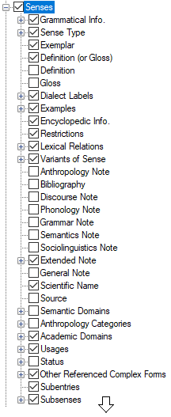
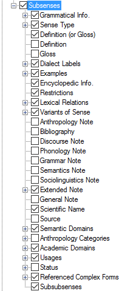
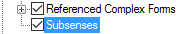

# Senses/Subsenses

*User Interface › Menus › Tools › Configure Dictionary*

In the [left pane](About_the_left_pane.md)**, there are multiple instances of the** **Senses** and **Subsenses** nodes in each [view](Dictionary_views.md).\
See  **Important** below.

<table width="100%">
<tbody>
<tr>
<th>
<strong>Example</strong>
</th>
<th>
<strong>Description</strong>
</th>
</tr>
&#10;<tr>
<td>

</td>
<td><ul>
<li>
<strong>Senses</strong> configures <a href="../../../Field_Descriptions/Lexicon/Lexicon_Edit_fields/Sense_level_fields/Sense_level_fields_overview.md">sense-level fields</a>.
</li>
</ul>
<ul>
<li>
In the <em>right</em> pane you can:
</li>
<li><ul>
<li>
Use <a href="Sense_No_Config_Dict.md">Sense Number Configuration</a> controls.
</li>
</ul></li>
</ul>
<ul>
<li><ul>
<li>
Select () or clear () <strong>If all senses share the grammatical information, show it first</strong>.
</li>
</ul></li>
</ul>
<ul>
<li><ul>
<li>
Use the <a href="Display_each_sense_in_a_paragraph.md">Display each sense in a paragraph</a> check box.
</li>
</ul></li>
</ul>
<ul>
<li><ul>
<li>
Use the <strong>Styles</strong> button to work with the <a href="../../Format/Styles/Styles_overview.md">style</a>.
</li>
</ul></li>
</ul></td>
</tr>
<tr>
<td>

</td>
<td><ul>
<li>
<strong>Subsenses</strong> configures <a href="../../../Field_Descriptions/Lexicon/Lexicon_Edit_fields/Sense_level_fields/Sense_level_fields_overview.md">sense-level fields</a> used in subsenses. <strong>Subsubsenses</strong> (at bottom) inherits the configuration set for <strong>Subsenses</strong>.
</li>
</ul>
<ul>
<li>
In the <em>right</em> pane you can:
</li>
<li><ul>
<li>
Use <a href="Sense_No_Config_Dict.md">Subsense Number Configuration</a> controls.
</li>
</ul></li>
</ul>
<ul>
<li><ul>
<li>
Select () or clear () <strong>Hide subsense grammatical info if same as parent</strong>.
</li>
</ul></li>
</ul>
<ul>
<li><ul>
<li>
Select () or clear () <strong>Display each subsense in a paragraph</strong>.
</li>
</ul></li>
</ul>
<ul>
<li><ul>
<li>
Use the <strong>Before</strong>/<strong>Between</strong>/<strong>After</strong> boxes and style controls. 
If subsenses are displayed in paragraphs,then paragraph styles () are used.
</li>
</ul></li>
</ul></td>
</tr>
<tr>
<td>
Another instance:

</td>
<td><ul>
<li>
In some instances, <strong>Subsenses</strong> has no subordinate notes.
</li>
</ul></td>
</tr>
</tbody>
</table>

> [!IMPORTANT]
>
> - You may see one of these statements in the right pane:
>
> **This configuration is shared. Hover for details.**
>
> **This item is configured somewhere else. Hover for details.**
>
> **See:** [Hover for details - examples.](Hover_for_details_example.md)

## Related topics
**<a href="Configure_Dictionary.md" style="font-weight: normal;">Configure Dictionary dialog box</a>**

[Display each sense in a paragraph](Display_each_sense_in_a_paragraph.md)

[Use right-click to help configure Dictionary](../../../../Using_Tools/Lexicon_tools/Dictionary/Use_right-click_to_help_configure_Dictionary_view.md)
