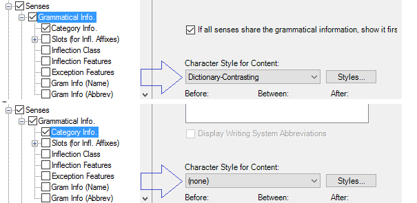

# Style example

*User Interface › Menus › Tools › Configure Dictionary*

In the **Configure Dictionary** dialog box, the style selected for a node () is applied to all of its subordinate nodes and fields, unless another style is selected for a subordinate node or field.

If the style control for a node or field shows **(none)**, click the parent nodes in the hierarchical structure until you see the node with a named style.

### Example

- The **Grammatical Info** node shows **Dictionary-Contrasting** in the **Character Style for Content** control. The **Category Info** field shows **(none)**. So, the **Dictionary-Contrasting** style controls the appearance of **Category Info**.

To distinguish **Category Info** field contents from other **Grammatical Info** contents, choose a different style for the **Category Info** field.

## Related topics
[Using the Configure Dictionary dialog box](Using_the_Configure_Dictionary_dialog_box.md)
