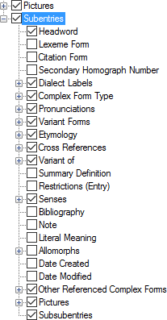

# Subentries

*User Interface › Menus › Tools › Configure Dictionary*

[Root-based](Dictionary_views.md) layouts only.

In the [left pane](About_the_left_pane.md)**,** **Subentries** appears under **Main** **Entry**.

(For [Hybrid](About_the_Hybrid_Dictionary_view.md) layouts, see [Minor Subentries](Minor_Subentries_(Hybrid_view).md).)

<table width="100%">
<tbody>
<tr>
<th>
<strong>Example</strong>
</th>
<th>
<strong>Description</strong>
</th>
</tr>
&#10;<tr>
<td>

</td>
<td>
With <strong>Subentries</strong> selected, you can do the following (<em>optional</em>):

<ul>
<li>
In the <em>left</em> pane, you can <a href="Duplicate_Dict_field.md">duplicate</a> <strong>Subentries</strong>, and then select different complex forms to display in each instance.
</li>
<li><ul>
<li>
Reorder the instances (<em>left</em> pane) using up arrows or down arrows.
</li>
</ul></li>
<li>
In the <em>right</em> pane, select () each <a href="../../../../Using_Tools/Lists_tools/About_complex_forms.md">complex form type</a> you want to display.
</li>
<li><ul>
<li>
Reorder the selected types (<em>right</em> pane) using up arrows or down arrows.
</li>
</ul></li>
<li>
Select () or clear () <strong>Display each Subentry in a paragraph</strong>. If selected, the <strong>Before</strong>, <strong>Between</strong> and <strong>After</strong> boxes are hidden (<em>right</em> pane).
</li>
<li>
Choose a paragraph style for content or use the <strong>Styles</strong> button to work with the style.
</li>
</ul>

Set the order of subentries in the <a href="../../../Field_Descriptions/Lexicon/Lexicon_Edit_fields/Publication_Settings_flds/Subentries_(Publication_Settings).md">Subentries</a> field (<strong>Publication Settings</strong>) and <a href="../../../Field_Descriptions/Lexicon/Lexicon_Edit_fields/Sense_level_fields/Subentries_(Sense).md">Subentries</a> field (<strong>Senses</strong>).
</td>
</tr>
<tr>
<td colspan="2">
Below <strong>Subentries</strong> is set of fields that is similar to <strong>Main Entry</strong>. You can:

<ul>
<li>
display different content in indented subentries as compared to content in main entries or minor entries
</li>
<li>
configure similar content separately
</li>
<li>
display <strong>Subsubentries</strong> (subentries <em>of subentries</em>). It will be configured the same as <strong>Subentries</strong>. You can add a custom paragraph style for subsubentries and customize the indentation values.
</li>
</ul></td>
</tr>
</tbody>
</table>

## Related topics
[Add a lexical subentry](../../../../Using_Tools/Lexicon_tools/Lexicon_Edit/Add_a_lexical_subentry.md)

**<a href="Configure_Dictionary.md" style="font-weight: normal;">Configure Dictionary dialog box</a>**

[Other Referenced Complex Forms](Other_Referenced_Complex_Forms.md)

[Use right-click to help configure Dictionary](../../../../Using_Tools/Lexicon_tools/Dictionary/Use_right-click_to_help_configure_Dictionary_view.md)
