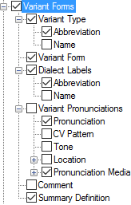

# Variant Forms

*User Interface › Menus › Tools › Configure Dictionary*

In the [left pane](About_the_left_pane.md), there are multiple instances of **Variant Forms** in all [layouts](Dictionary_views.md). You configure each instance separately.

For [Hybrid](About_the_Hybrid_Dictionary_view.md)i layouts, see [\[References Section\]](References_Section_(Config._Dict.).md) and [Variant Forms (Inflected Variants)](Variant_Forms_(Inflectional_Variants).md).

- In the *right* pane, select () each [variant type](../../../../Using_Tools/Lists_tools/About_Variants.md) you want to display.\
  Optionally, you can do the following:

  - In the *left* pane, [duplicate](Duplicate_Dict_field.md) **Variant Forms**. Then, select different types to display in each instance.

  - Use up arrows or down arrows to reorder the instances (*left* pane) or selected types (*right* pane).

When the entry (*not* a specific sense of the entry) is [chosen](../../../../Using_Tools/Lexicon_tools/Lexicon_Edit/Choose_Variant_of_entry.md) for a variant form, you use **Variant Forms** to configure *references to variant forms* (as they appear in the primary entry).

<table width="100%">
<tbody>
<tr>
<th>
<strong>Example</strong>
</th>
<th>
<strong>Description/Content Sources</strong>
</th>
</tr>
&#10;<tr>
<td>
<strong></strong>
</td>
<td>
If selected (), contents from these fields are displayed:

<ul>
<li>
<strong>Variant Type</strong>: <a href="../../../Field_Descriptions/Lists/Variant_Types_flds/abbreviation_fld_variant_types.md">Abbreviation</a> or <a href="../../../Field_Descriptions/Lists/Variant_Types_flds/name_fid_variant_types.md">Name</a> field, or both from the <strong>Variant Types</strong> <a href="../../../../Using_Tools/Lists_tools/List_item_usage_table.md">list</a>.
</li>
</ul>
<ul>
<li>
<strong>Variant Form</strong>: headword of the variant entry from the <a href="../../../Field_Descriptions/Lexicon/Lexicon_Edit_fields/Variants_level_fields/Variant_Form_field.md">Variant Form</a> field
</li>
<li>
<strong>Dialect Labels</strong>: <a href="../../../Field_Descriptions/Lists/Dialect_Labels/Abbreviation_field_(Dialect_Labels).md">Abbreviation</a>, <a href="../../../Field_Descriptions/Lists/Dialect_Labels/Full_Name_field_(Dialect_Labels).md">Full Name</a> or both from the <strong>Dialect Labels</strong> <a href="../../../../Using_Tools/Lists_tools/List_item_usage_table.md">list</a>.
</li>
<li>
<strong>Variant Pronunciations</strong>: from the variant entry. <strong>See:</strong> <a href="Pronunciations.md">Pronunciation</a>
</li>
<li>
<strong>Comment</strong>: <a href="../../../Field_Descriptions/Lexicon/Lexicon_Edit_fields/Variants_level_fields/Comment_field_Variants.md">Comment</a> field
</li>
<li>
<strong>Summary Definition</strong>: <a href="../../../Field_Descriptions/Lexicon/Lexicon_Edit_fields/Entry_level_fields/Summary_Definition_field.md">Summary Definition</a> field.
</li>
</ul></td>
</tr>
<tr>
<td colspan="2">
<strong>See Also:</strong> <a href="Variants_of_Sense.md">Variants of Sense</a> and <a href="Variant_of.md">Variant of</a>.
</td>
</tr>
</tbody>
</table>

## Related topics
[Abbreviation and Name](abbreviation_and_name.md)

[About entry types](../../../../Using_Tools/Lists_tools/About_Entry_Types.md)

**<a href="Configure_Dictionary.md" style="font-weight: normal;">Configure Dictionary dialog box</a>**

[Free Variant](../../../Field_Descriptions/Lists/Variant_Types_flds/Free_Variant.md)

[Irregularly Inflected Form](../../../Field_Descriptions/Lists/Variant_Types_flds/Irregularly_Inflected_Form.md)

[Use right-click to help configure Dictionary](../../../../Using_Tools/Lexicon_tools/Dictionary/Use_right-click_to_help_configure_Dictionary_view.md)
