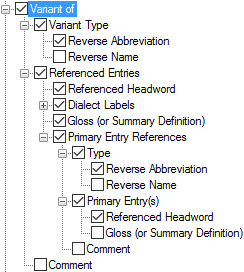

# Variant of

*User Interface › Menus › Tools › Configure Dictionary*

In the [left pane](About_the_left_pane.md), there are multiple instances of **Variant of** in all [layouts](Dictionary_views.md) (for [minor entries](Main_Minor_entry.md) or [Subentries](Subentries.md)). You configure each instance separately.

- In the *right* pane, select () each [variant type](../../../../Using_Tools/Lists_tools/About_Variants.md) you want to display.\
  Optionally, you can do the following:

  - In the *left* pane, [duplicate](Duplicate_Dict_field.md) **Variant of**. Then, select different types to display in each instance.

  - Use up arrows or down arrows to reorder the instances (*left* pane), or selected types (*right* pane).

<table width="100%">
<tbody>
<tr>
<th>
<strong>Example</strong>
</th>
<th>
<strong>Description/Content Sources</strong>
</th>
</tr>
&#10;<tr>
<td>
<strong></strong>
</td>
<td></td>
</tr>
<tr>
<td colspan="2">
If selected (), contents from these fields are displayed:

<ul>
<li>
<strong>Variant Type</strong>: <a href="../../../Field_Descriptions/Lists/Variant_Types_flds/Reverse_Abbr_fld_Variant_Types.md">Reverse Abbr</a>, <a href="../../../Field_Descriptions/Lists/Variant_Types_flds/Reverse_Name_field_(Variant_Types).md">Reverse Name</a>, or both from the <strong>Variant Types</strong> <a href="../../../../Using_Tools/Lists_tools/List_item_usage_table.md">list</a>
</li>
<li>
<strong>Referenced Entries</strong>:
</li>
<li><ul>
<li>
<strong>Referenced Headword</strong>: the headword of the primary entry. (In the variant entry, it appears in the <a href="../../../Field_Descriptions/Lexicon/Lexicon_Edit_fields/Entry_level_fields/Variant_of_field.md">Variant of</a> field.)
</li>
<li>
<strong>Dialect Labels</strong>: <a href="../../../Field_Descriptions/Lists/Dialect_Labels/Abbreviation_field_(Dialect_Labels).md">Abbreviation</a>, <a href="../../../Field_Descriptions/Lists/Dialect_Labels/Full_Name_field_(Dialect_Labels).md">Full Name</a> or both from the <strong>Dialect Labels</strong> <a href="../../../../Using_Tools/Lists_tools/List_item_usage_table.md">list</a>.
</li>
<li>
<strong>Gloss (or Summary Definition)</strong>: the <a href="../../../Field_Descriptions/Lexicon/Lexicon_Edit_fields/Sense_level_fields/Gloss_field_Sense.md">gloss</a> from the <a href="../../../../Using_Tools/Lexicon_tools/Lexicon_Edit/Choose_Variant_of_entry.md">chosen</a> sense <em>or</em> the <a href="../../../Field_Descriptions/Lexicon/Lexicon_Edit_fields/Entry_level_fields/Summary_Definition_field.md">summary definition</a> from the chosen entry
</li>
</ul></li>
</ul>
<ul>
<li><ul>
<li>
<strong>Primary Entry References</strong>:
</li>
<li><ul>
<li>
<strong>Type:</strong> <a href="../../../Field_Descriptions/Lists/Complex_Form_Types_flds/reverse_abbr_fld_(complex_fm_types).md">Reverse Abbreviation</a> or <a href="../../../Field_Descriptions/Lists/Complex_Form_Types_flds/Reverse_Name_field_(Complex_Form_Types).md">Reverse Name</a> from the <strong>Complex Form Types</strong> <a href="../../../Field_Descriptions/Lists/Complex_Form_Types_flds/complex_fm_types_flds_overview.md">list</a> as selected in the <a href="../../../Field_Descriptions/Lexicon/Lexicon_Edit_fields/Entry_level_fields/Complex_Form_Type_field.md">Complex Form Type</a> field in the referenced complex entry, <em>or</em> <a href="../../../Field_Descriptions/Lists/Variant_Types_flds/Reverse_Abbr_fld_Variant_Types.md">Reverse Abbreviation</a> or <a href="../../../Field_Descriptions/Lists/Variant_Types_flds/Reverse_Name_field_(Variant_Types).md">Reverse Name</a> from the <strong>Variant Types</strong> <a href="../../../Field_Descriptions/Lists/Variant_Types_flds/variant_types_flds_overview.md">list</a> as selected in the <a href="../../../Field_Descriptions/Lexicon/Lexicon_Edit_fields/Entry_level_fields/Variant_Type_field.md">Variant Type</a> field in the referenced variant entry.
</li>
<li>
<strong>Referenced Headword</strong>: the headword of the referenced complex form or variant entry.
</li>
<li>
<strong>Gloss (or Summary Definition)</strong>: the <a href="../../../Field_Descriptions/Lexicon/Lexicon_Edit_fields/Sense_level_fields/Gloss_field_Sense.md">gloss</a> from the chosen sense when <strong>Specific Sense</strong> is selected. If there is no gloss, then the <a href="../../../Field_Descriptions/Lexicon/Lexicon_Edit_fields/Entry_level_fields/Summary_Definition_field.md">Summary Definition</a> field from the referenced entry.
</li>
<li>
<strong>Comment</strong>: <a href="../../../Field_Descriptions/Lexicon/Lexicon_Edit_fields/Entry_level_fields/Comment_field.md">Comment</a> field associated with the <strong>Complex Form Type</strong> field or with the <strong>Variant Type</strong> field.
</li>
</ul></li>
</ul></li>
</ul>
<ul>
<li>
<strong>Comment</strong>: <a href="../../../Field_Descriptions/Lexicon/Lexicon_Edit_fields/Entry_level_fields/Comment_field.md">Comment</a> field of referenced entry.
</li>
</ul></td>
</tr>
<tr>
<td colspan="2"><blockquote>

<ul>
<li>
<strong>See Also:</strong> <a href="Variants_of_Sense.md">Variants of Sense</a> and <a href="Variant_Forms.md">Variant Forms</a>. For Hybrid layouts, see <a href="Variant_Forms_(Inflectional_Variants).md">Variant Forms (Inflected Variants)</a>.
</li>
<li>
<strong>Primary Entry References</strong> allows references to variants or complex forms to display the main entry of the referenced form.
</li>
</ul>
</blockquote></td>
</tr>
</tbody>
</table>

## Related topics
[Abbreviation and Name](abbreviation_and_name.md)

[Component References](Component_References.md)

**<a href="Configure_Dictionary.md" style="font-weight: normal;">Configure Dictionary dialog box</a>**

[Free Variant](../../../Field_Descriptions/Lists/Variant_Types_flds/Free_Variant.md)

[Irregularly Inflected Form](../../../Field_Descriptions/Lists/Variant_Types_flds/Irregularly_Inflected_Form.md)

[Use right-click to help configure Dictionary](../../../../Using_Tools/Lexicon_tools/Dictionary/Use_right-click_to_help_configure_Dictionary_view.md)
