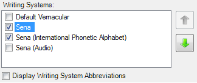

# Writing Systems

*User Interface › Menus › Tools › Configure Dictionary*

When you click some of the fields or nodes () in the [left pane](About_the_left_pane.md), the *right* pane displays **Writing Systems**. Depending on what you clicked in the left pane, the listed writing systems are either the vernacular or the analysis.

Typically, the top item is **Default Vernacular** or **Default Analysis**. Then, the name of that default writing system is listed, along with any others.

### Example

In this example, Sena is the default vernacular. If you select () **Default Vernacular** or **Sena**, you get the same writing system.

If two or more writings are selected ():

- Select () **Display Writing System Abbreviations** if you want to display [abbreviations](../../../../Advanced_Tasks/Writing_Systems/Modifying_a_Writing_System/Writing_System_Properties_General_tab.md).

- You can click  (**Move Up**) or  (**Move Down**) to reorder the writing systems.

## Related topics
<a href="Configure_Dictionary.md" style="font-weight: normal;">Configure Dictionary dialog box</a>

[Configure Reversal Index dialog box](../Configure_Reversal_Index/Configure_Reversal_Index_dialog_box.md)
