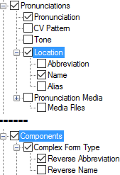

# Abbreviation and Name

*User Interface › Menus › Tools › Configure Dictionary*

When you configure fields or nodes () that reference [list reference fields](../../../Field_Descriptions/Field_Types/List_reference_field.md), you see contents from other areas, such as from [Lists](../../../../Using_Tools/Lists_tools/List_item_usage_table.md) and [Grammar](../../../../Using_Tools/Grammar_tools/grammar_overview.md). As a consequence, **Abbreviation** and **Name** *or* **Reverse Abbreviation** and **Reverse Name** often appear together in the [left pane](About_the_left_pane.md).

You can choose to configure the display of the referenced item's abbreviation, name or both in [Dictionary](../../../../Using_Tools/Lexicon_tools/Dictionary/Dictionary_overview.md). Typically only the name or abbreviation is desired.

<table>
<tbody>
<tr>
<th>
<strong>Examples</strong>
</th>
<th>
<strong>Content Sources</strong>
</th>
</tr>
&#10;<tr>
<td>
<strong></strong>
</td>
<td>
Two examples are shown here.

If selected (), contents from these fields are displayed:

<ul>
<li>
<strong>Location</strong>: the <a href="../../../Field_Descriptions/Lists/Locations_fields/abbreviation_field_locations.md">Abbreviation</a>, <a href="../../../Field_Descriptions/Lists/Locations_fields/location_name_field_locations.md">Name</a> or <a href="../../../Field_Descriptions/Lists/Locations_fields/alias_field_locations.md">Alias</a> from the <strong>Locations</strong> <a href="../../../../Using_Tools/Lists_tools/List_item_usage_table.md">list</a> 
 
 
 
 
 
 

</li>
<li>
<strong>Complex Form Type</strong>: the <a href="../../../Field_Descriptions/Lists/Complex_Form_Types_flds/reverse_abbr_fld_(complex_fm_types).md">Reverse Abbreviation</a> and <a href="../../../Field_Descriptions/Lists/Complex_Form_Types_flds/Reverse_Name_field_(Complex_Form_Types).md">Reverse Name</a> from the <strong>Complex Form Type</strong> list
</li>
</ul></td>
</tr>
</tbody>
</table>

## Related topics
[Configure Dictionary dialog box](Configure_Dictionary.md)

[Using the Configure Dictionary dialog box](Using_the_Configure_Dictionary_dialog_box.md)
