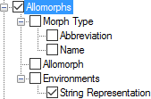

# Allomorphs

*User Interface › Menus › Tools › Configure Dictionary*

In the [left pane](About_the_left_pane.md)**,** **Allomorphs** appears under **Main** **Entry**, **Minor Entry (Complex Forms)**, **Minor Entry (Variants)** and **<a href="Subentries.md" style="font-weight: normal;">Subentries</a>**.

<table style="width: 790px;">
<tbody>
<tr>
<th>
<strong>Example</strong>
</th>
<th>
<strong>Content Sources</strong>
</th>
</tr>
&#10;<tr>
<td>
<strong></strong>
</td>
<td>
If selected (), contents from these fields are displayed:

<ul>
<li>
<strong>Morph Type</strong>: <a href="../../../Field_Descriptions/Lexicon/Lexicon_Edit_fields/Alternate_Forms_level_flds/Morph_type_fld_allomorph.md">Morph Type</a> field (<a href="../../../Field_Descriptions/Lists/Morpheme_Types_fields/abbreviation_field_morpheme_types.md">Abbreviation</a>, <a href="../../../Field_Descriptions/Lists/Morpheme_Types_fields/Name_field_Morpheme_Types.md">Name</a> or both from <strong>Morpheme Types</strong> <a href="../../../../Using_Tools/Lists_tools/List_item_usage_table.md">list</a>)
</li>
<li>
<strong>Allomorphs</strong>: <a href="../../../Field_Descriptions/Lexicon/Lexicon_Edit_fields/Alternate_Forms_level_flds/Affix_allomorph_fld.md">Affix Allomorph</a> or <a href="../../../Field_Descriptions/Lexicon/Lexicon_Edit_fields/Alternate_Forms_level_flds/Stem_Allomorph_fld.md">Stem Allomorph</a> field content
</li>
<li>
<strong>Environments</strong>
</li>
<li><ul>
<li>
<strong>String Representation</strong>: <a href="../../../Field_Descriptions/Lexicon/Lexicon_Edit_fields/Alternate_Forms_level_flds/Environments_fld_allomorph.md">Environments</a> field
</li>
</ul></li>
</ul></td>
</tr>
</tbody>
</table>

## Related topics
[Abbreviation and Name](abbreviation_and_name.md)

<a href="Configure_Dictionary.md" style="font-weight: normal;">Configure Dictionary dialog box</a>

[Swap Lexeme Form with Allomorph](../../../../Using_Tools/Lexicon_tools/Lexicon_Edit/Swap_LexForm_with_Allomorph.md)

[Using the Configure Dictionary dialog box](Using_the_Configure_Dictionary_dialog_box.md)
