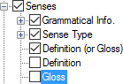

# Gloss

*User Interface › Menus › Tools › Configure Dictionary*

In the [left pane](About_the_left_pane.md) of the **Configure Dictionary** **dialog box**, **Gloss** appears under each **Senses** node, but only under some of the **Subsenses** nodes.\
**See:** [Senses/Subsenses](Senses_Subsenses.md).

<table>
<tbody>
<tr>
<th>
<strong>Example</strong>
</th>
<th>
<strong>Description</strong>
</th>
</tr>
&#10;<tr>
<td>
<strong></strong>
</td>
<td>
If selected (), content from the <strong>Gloss</strong> field is displayed.

If <a href="Definition_or_Gloss.md">Definition (or Gloss)</a> is <em>also</em> selected, there may be some redundancy.
</td>
</tr>
</tbody>
</table>

> [!NOTE]
>
> - In addition, you can *separately* configure **Gloss** field content under other items such as [Lexical Relations](Lexical_Relations.md).

## Related topics
<a href="Configure_Dictionary.md" style="font-weight: normal;">Configure Dictionary dialog box</a>

[Gloss field](../../../Field_Descriptions/Lexicon/Lexicon_Edit_fields/Sense_level_fields/Gloss_field_Sense.md)
