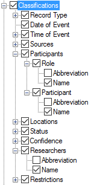
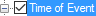

# Classifications

*User Interface › Menus › Tools › Configure Document*

Here is an example of **Classifications**. Click  to expand and display subordinate items. Each of these fields store data that help classify the record.

<table width="100%">
<tbody>
<tr>
<th>
Classifications
</th>
<th>
Description
</th>
</tr>
&#10;<tr>
<td>
<strong>Example:</strong>

</td>
<td>
Under <strong>Classifications</strong> you can choose to display and configure content from multiple different field. In some cases.

<h3 id="check-boxes">Check boxes</h3>
<ul>
<li>
If a check box is selected (), then that item and other selected items subordinate to it are displayed. In this example, the <strong>Participants</strong> will be displayed. Specifically, for the <strong>Role</strong>, the <strong>Name</strong> is displayed, and for <strong>Participant</strong>, the <strong>Name</strong>. The <strong>Abbreviation</strong> for <strong>Role</strong> and <strong>Participant</strong> are not displayed.
</li>
</ul>

<strong> Tip</strong>

<ul>
<li>
<a href="../../../Field_Descriptions/Notebook/Sources_field_Ntbk.md">Sources</a>, <a href="../../../Field_Descriptions/Notebook/Participants_field_Ntbk.md">Participants</a>, and <a href="../../../Field_Descriptions/Notebook/Researchers_field_Ntbk.md">Researchers</a> use the <strong>People</strong> list. Otherwise, the <a href="../../../Field_Descriptions/Field_Types/List_reference_field.md">list reference field</a> label usually matches the name of the <a href="../../../Field_Descriptions/Lists/Lists_fields_overview.md">list</a>.
</li>
</ul>
<h3 id="highlighted-item">Highlighted item</h3>
<ul>
<li>
In the left pane, you click an item to <em>highlight</em> it, such as a . Then, the right pane shows the appropriate configuration options so you can <a href="Configuring_a_Document_view.md">configure</a> the appearance of the item, including surrounding context and <a href="Configuring_Document_view_styles.md">styles</a>.
</li>
</ul></td>
</tr>
</tbody>
</table>

## Related topics
[Configure Document View dialog box](Configure_Document_View_dialog_box.md)

[Configuring the Document Layout](Configuring_a_Document_view.md)
