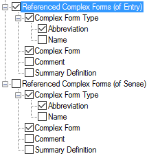

# Referenced Complex Forms (Reversal Indexes)

*User Interface › Menus › Tools › Configure Reversal Index*

Two instances of **Referenced Complex Forms** appear below **Referenced Senses** in the left pane. One is for complex forms that reference *entries*; the second is for complex forms that reference specific *senses*.

**You [configure](Configuring_a_reversal_index_view.md) each separately.**

<table width="100%">
<tbody>
<tr>
<th>
<strong>Example</strong>
</th>
<th>
<strong>Description/Content Sources</strong>
</th>
</tr>
&#10;<tr>
<td>

</td>
<td>
<strong>(of Entry)</strong>

<ul>
<li><ul>
<li>
<a href="../../../Field_Descriptions/Lists/Complex_Form_Types_flds/abbr_fld_(complex_fm_types).md">Abbreviation</a> field
</li>
<li>
<a href="../../../Field_Descriptions/Lists/Complex_Form_Types_flds/name_fld_(complex_fm_types).md">Name</a> field
</li>
</ul></li>
<li>
<a href="../../../Field_Descriptions/Lexicon/Lexicon_Edit_fields/Publication_Settings_flds/Referenced_Complex_Forms_Publication_Settings.md">Referenced Complex Forms</a> field (<strong>Publication Settings</strong>)
</li>
<li>
<strong>Complex Form</strong> is the lexical headword
</li>
<li>
<a href="../../../Field_Descriptions/Lexicon/Lexicon_Edit_fields/Entry_level_fields/Comment_field.md">Comment</a> field
</li>
<li>
<a href="../../../Field_Descriptions/Lexicon/Lexicon_Edit_fields/Entry_level_fields/Summary_Definition_field.md">Summary Definition</a> field
</li>
</ul>

<strong>(of Sense)</strong>

<ul>
<li><ul>
<li>
<a href="../../../Field_Descriptions/Lists/Complex_Form_Types_flds/abbr_fld_(complex_fm_types).md">Abbreviation</a> field
</li>
<li>
<a href="../../../Field_Descriptions/Lists/Complex_Form_Types_flds/name_fld_(complex_fm_types).md">Name</a> field
</li>
</ul></li>
<li>
<a href="../../../Field_Descriptions/Lexicon/Lexicon_Edit_fields/Sense_level_fields/Referenced_Complex_Forms_(sense).md">Referenced Complex Forms</a> field (<strong>Senses</strong>)
</li>
<li>
<strong>Complex Form</strong> is the lexical headword
</li>
<li>
<a href="../../../Field_Descriptions/Lexicon/Lexicon_Edit_fields/Entry_level_fields/Comment_field.md">Comment</a> field
</li>
<li>
<a href="../../../Field_Descriptions/Lexicon/Lexicon_Edit_fields/Entry_level_fields/Summary_Definition_field.md">Summary Definition</a> field.
</li>
</ul></td>
</tr>
<tr>
<td colspan="2">
In the <em>right</em> pane, use the  (<strong>Move Up</strong>) and  (<strong>Move Down</strong>) arrows to order complex forms <em>by type</em>.

The <em>secondary sort order</em> is the order of the complex forms in <strong>Lexicon Edit</strong> fields (<a href="../../../Field_Descriptions/Lexicon/Lexicon_Edit_fields/Publication_Settings_flds/Referenced_Complex_Forms_Publication_Settings.md">Referenced Complex Forms (entry)</a>, <a href="../../../Field_Descriptions/Lexicon/Lexicon_Edit_fields/Sense_level_fields/Referenced_Complex_Forms_(sense).md">Referenced Complex Forms (sense)</a> and so on).
</td>
</tr>
</tbody>
</table>

## Related topics
[Configure Headword Numbers](../Configure_Headword_Numbers/Config_Hdwrd_Numbers_dialog_box.md)

[Configure Reversal Index dialog box](Configure_Reversal_Index_dialog_box.md)

[Use right-click to help configure Dictionary](../../../../Using_Tools/Lexicon_tools/Dictionary/Use_right-click_to_help_configure_Dictionary_view.md)
