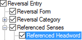

# Referenced Headword, Referenced Senses

*User Interface › Menus › Tools › Configure Reversal Index*

A "headword" consist of the lexeme form or citation form plus any homograph number. In addition, for a *referenced* headword, it can also include the sense number, if a specific sense was [chosen](../../../../Using_Tools/Lexicon_tools/Lexicon_Edit/Choose_components_for_Components_field.md).

In the **Configure Reversal Index** dialog box, you use **Referenced Headword** to access controls for the referenced headword itself, and also any [homograph and sense numbers](../Configure_Headword_Numbers/Config_Hdwrd_Numbers_dialog_box.md).

<table width="100%">
<tbody>
<tr>
<th>
<strong>Example</strong>
</th>
<th>
<strong>Description/Content Sources</strong>
</th>
</tr>
&#10;<tr>
<td>

</td>
<td><ul>
<li>
You can use <strong>Character style for content</strong> to choose a style, or the <strong>Style</strong> button to work with <a href="../../Format/Styles/Styles_overview.md">styles</a>.
</li>
<li>
Enter spaces, symbols, characters or words in <strong>Before</strong>, <strong>Between</strong> or <strong>After</strong> boxes.
</li>
<li>
Click the <strong>Configure Referenced Headwords</strong> button to work with <em>default</em> homograph number or lexical sense numbers. 
<strong>See:</strong> <a href="../Configure_Headword_Numbers/Config_Hdwrd_Numbers_dialog_box.md">Configure Headword Numbers dialog box</a>.
</li>
</ul></td>
</tr>
</tbody>
</table>

## Related topics
[About the Reversal-Vernacular style](../../Format/Styles/About_the_Reversal-Vernacular_style.md)

[Configure Reversal Index dialog box](Configure_Reversal_Index_dialog_box.md)

[Referenced Headword - Primary Entry References](Referenced_Headword%2c_Primary_Entry_References.md)

[Referenced Senses](Referenced_Senses.md)
