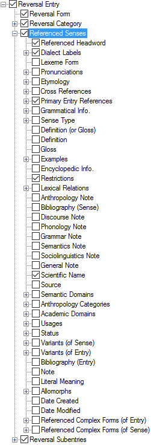

# Referenced Senses

*User Interface › Menus › Tools › Configure Reversal Index*

The fields and nodes () below **Referenced Senses** match or relate to [fields](../../../Field_Descriptions/Lexicon/Lexicon_Edit_fields/Lexicon_Edit_fields_overview.md) in **Lexicon Edit**. Accordingly, they function *similarly* to the corresponding items in the **Configure Dictionary** dialog box.

As a result, you can get applicable understanding from **Configure Dictionary** topics such as the examples listed in [About the "left pane"](../Configure_Dictionary/About_the_left_pane.md).

<table width="100%">
<tbody>
<tr>
<th colspan="2">
<strong>Example</strong>
</th>
</tr>
&#10;<tr>
<td>

</td>
<td></td>
</tr>
</tbody>
</table>

## Related topics
[Configure Reversal Index dialog box](Configure_Reversal_Index_dialog_box.md)

[Sense Number Configuration](Sense_Number_Configuration.md)
