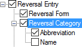

# Reversal Category

*User Interface › Menus › Tools › Configure Reversal Index*

In the **Configure Reversal Index** dialog box, **Reversal Category** [configures](Configuring_a_reversal_index_view.md) the display of category information from the [Reversal Category](../../../Field_Descriptions/Lexicon/Reversal_Indexes_fields/category_field.md) field. These categories are stored in the **Reversal Index Categories** [list](../../../../Using_Tools/Lists_tools/about_reversal_index_categories.md).

<table width="100%">
<tbody>
<tr>
<th colspan="2">
<strong>Example</strong>
</th>
</tr>
&#10;<tr>
<td>

</td>
<td>
<strong>Abbreviation</strong>: <a href="../../../Field_Descriptions/Lists/Reversal_Index_Categories_fields/Abbreviation_field_Reversal_Index_Categories.md">Abbreviation field</a>.

<strong>Name</strong>: <a href="../../../Field_Descriptions/Lists/Reversal_Index_Categories_fields/Name_field_Reversal_Index_Categories.md">Name field</a>.
</td>
</tr>
</tbody>
</table>

<table width="100%">
<tbody>
<tr>
<th>
<strong>Controls in the</strong> <em>right</em> <strong>pane</strong>
</th>
</tr>
&#10;<tr>
<td>
<strong>Writing Systems</strong> (for <strong>Abbreviation</strong> or <strong>Name</strong>)

<ul>
<li>
You can select () <strong>Current Reversal Index</strong>, or one or more particular analysis writing systems.
</li>
</ul>

<strong>Reversal Index Categories</strong> <a href="../../../../Using_Tools/Lists_tools/about_reversal_index_categories.md">lists</a> categories <em>by writing system</em>.

<strong>Display Writing System Abbreviation</strong> is available if more than one writing system is selected ().

<strong>Character Style for Content</strong>

<ul>
<li>
You can choose a character () <a href="../../Format/Styles/Styles_overview.md">style</a>.
</li>
</ul>

<strong>Before</strong>, <strong>Between</strong> or <strong>After</strong> boxes (<a href="../Configure_Dictionary/Surrounding_Context.md">surrounding context</a>).
</td>
</tr>
</tbody>
</table>

## Related topics
[About the Reversal-Vernacular style](../../Format/Styles/About_the_Reversal-Vernacular_style.md)

[About Reversal Entries](../../../../Using_Tools/Lexicon_tools/Lexicon_Edit/About_Reversal_Entries.md)

[Configure Reversal Index dialog box](Configure_Reversal_Index_dialog_box.md)
