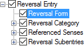

# Reversal Form

*User Interface › Menus › Tools › Configure Reversal Index*

In the **Configure Reversal Index** dialog box, **Reversal Form** [configures](Configuring_a_reversal_index_view.md) the display of content from the [Reversal Form](../../../Field_Descriptions/Lexicon/Reversal_Indexes_fields/form_field.md) field. These forms match the content from the [Reversal Entries](../../../Field_Descriptions/Lexicon/Lexicon_Edit_fields/Sense_level_fields/reversal_entries_field.md) field in **Lexicon Edit**.

<table width="100%">
<tbody>
<tr>
<th colspan="2">
<strong>Example</strong>
</th>
</tr>
&#10;<tr>
<td>

</td>
<td></td>
</tr>
</tbody>
</table>

<table width="100%">
<tbody>
<tr>
<th>
<strong>Controls in the</strong> <em>right</em> <strong>pane</strong>
</th>
</tr>
&#10;<tr>
<td>
<strong>Character Style for Content</strong>

<ul>
<li>
You can choose a character () <a href="../../Format/Styles/Styles_overview.md">style</a>, or click <strong>Styles</strong> to modify the style.
</li>
</ul>

<strong>Before</strong>, <strong>Between</strong> or <strong>After</strong> boxes (<a href="../Configure_Dictionary/Surrounding_Context.md">surrounding context</a>).
</td>
</tr>
</tbody>
</table>

> [!NOTE]
>
> - In the current version, using the **Writing Systems** control does *not* display forms in other analysis writing systems.

## Related topics
[About the Reversal-Vernacular style](../../Format/Styles/About_the_Reversal-Vernacular_style.md)

[About Reversal Entries](../../../../Using_Tools/Lexicon_tools/Lexicon_Edit/About_Reversal_Entries.md)

[Configure Reversal Index dialog box](Configure_Reversal_Index_dialog_box.md)
