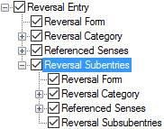

# Reversal Subentries

*User Interface › Menus › Tools › Configure Reversal Index*

In **Reversal Indexes**, subentries appear below the [Subentries](../../../Field_Descriptions/Lexicon/Reversal_Indexes_fields/Subentries_field.md) field.

In the **Configure Reversal Index** dialog box, **Reversal Subentries** node has another set of these nodes: [Reversal Form](Reversal_Form.md), [Reversal Category](Reversal_Category.md), [Referenced Senses](Referenced_Senses.md) and **Reversal Subsubentries**. You use them to [configure](Configuring_a_reversal_index_view.md) the display of these subentries.

<table width="100%">
<tbody>
<tr>
<th colspan="2">
<strong>Example</strong>
</th>
</tr>
&#10;<tr>
<td>

</td>
<td></td>
</tr>
</tbody>
</table>

<table width="100%">
<tbody>
<tr style="height: 20px;">
<th>
<strong>Controls in the</strong> <em>right</em> <strong>pane</strong>
</th>
</tr>
&#10;<tr style="height: 176px;">
<td>
<strong>Display each Subentry in a paragraph</strong>

<ul>
<li>
If selected (), subentries are displayed in separate paragraphs.
</li>
</ul>

Then, a paragraph () <a href="../../Format/Styles/Styles_overview.md">style</a> is used for reversal subentries. 
<strong>Reversal-Subentry</strong> is the default style.

<ul>
<li>
If cleared (), subentries appear as part of the main reversal entry.
</li>
</ul>

Then, a character () <a href="../../Format/Styles/Styles_overview.md">style</a> is used. <strong>Before</strong>, <strong>Between</strong> or <strong>After</strong> boxes (<a href="../Configure_Dictionary/Surrounding_Context.md">surrounding context</a>) also appear.

<strong>Reversal Subsubentries</strong> uses the configurations set for <strong>Reversal Subentries</strong>. So, the <strong>Configure now</strong> button appears if you click the <strong>Reversal Subsubentries</strong> label to highlight it ().

<ul>
<li>
Click the button to move the focus to the <strong>Reversal Subentries</strong> node.
</li>
</ul></td>
</tr>
</tbody>
</table>

## Related topics
[About the Reversal-Vernacular style](../../Format/Styles/About_the_Reversal-Vernacular_style.md)

[About Reversal Entries](../../../../Using_Tools/Lexicon_tools/Lexicon_Edit/About_Reversal_Entries.md)

[Configure Reversal Index dialog box](Configure_Reversal_Index_dialog_box.md)
