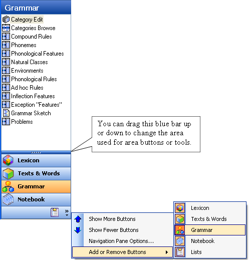

# Navigation Pane graphic

*User Interface › Toolbars › Navigation*

Here is an example of the **Navigation Pane**, showing the cascading menus (menu and a submenu) displayed.

> [!NOTE]
>
> - Your colors may vary, depending on your computer's display property settings.

## Related topics
[Navigation Pane overview](Navigation_Pane_overview.md)

[User Interface overview](../../User_Interface_overview.md)
