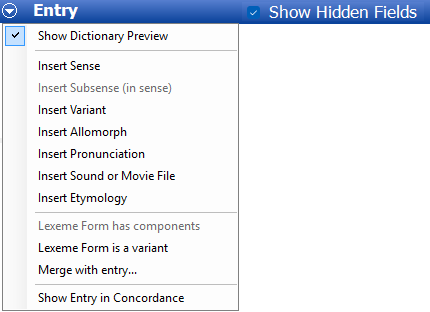
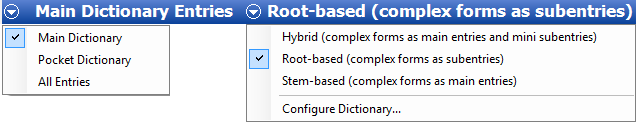
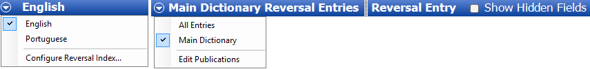
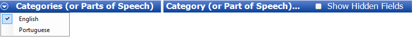

# Information bar overview

*User Interface › Toolbars*

Information bars are located below the toolbars. The Information bar can contain any of the following features, depending on what is in the pane below it:

- A *name* that identifies the pane or data.

- Check boxes, such as **Show Hidden Fields**, **Show Unused Items** or **Add Words to Lexicon**.

- A menu button  that lists [context-sensitive menu](../../Basic_Tasks/Show_data/Context_sens_menus.md) commands.

## Some Examples

- [Lexicon Edit](../../Using_Tools/Lexicon_tools/Lexicon_Edit/lexicon_edit_overview.md) `-` drop-down menu displayed:

****

- [Dictionary](../../Using_Tools/Lexicon_tools/Dictionary/Dictionary_overview.md) **-** *composite* picture ([Select a publication](../../Using_Tools/Lexicon_tools/Dictionary/Select_a_publication.md) and [Select a dictionary layout](../../Using_Tools/Lexicon_tools/Dictionary/Select_a_dictionary_view.md)):

- [Classified Dictionary](../../Using_Tools/Lexicon_tools/Classified_Dictionary/Classified_Dictionary_overview.md)

The layout set in **Dictionary** is also used here.

- [Reversal Indexes](../../Using_Tools/Lexicon_tools/Reversal_Indexes/reversal_indexes_overview.md) **-** *composite* picture ([Select a reversal index layout](../../Using_Tools/Lexicon_tools/Reversal_Indexes/Select_a_Reversal_index_view.md) and [Select a publication](../../Using_Tools/Lexicon_tools/Dictionary/Select_a_publication.md)):

- [Reversal Index Categories](../../Using_Tools/Lists_tools/about_reversal_index_categories.md) (**Lists**):

- [Interlinear Texts](../../Using_Tools/Texts_%26_Words_tools/Interlinear_Texts/texts_edit_overview.md) (**Gloss** tab):

## Related topics
[Add Words to Lexicon](../../Using_Tools/Texts_%26_Words_tools/Interlinear_Texts/About_Add_Words_to_Lexicon.md)

[Create a new Publication](../../Using_Tools/Lists_tools/Create_new_publication.md)

[Show data overview](../../Basic_Tasks/Show_data/Show_data_overview.md)

[Show Hidden Fields](../../Basic_Tasks/Showing_and_hiding_fields/Show_Hidden_Fields.md)

[Show Unused Items](../../Using_Tools/Lexicon_tools/Classified_Dictionary/Show_Unused_Items.md)

[Target field selection](../../Using_Tools/Lexicon_tools/Bulk_Edit_Entries/Target_field_selection.md) (**Bulk Edit**)

[User Interface overview](../User_Interface_overview.md)
