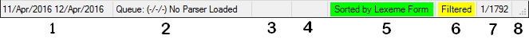

# Status bar

*User Interface › Toolbars*

The *status bar* displays information at the bottom of the window.

The content of each area is listed below, starting at the left end of the status bar.

1.  The [dates](../Field_Descriptions/Field_Types/date_field.md) indicate the *creation date* and *date modified* of the current selection.

2.  [Parser](../Menus/Parser/Parser_menu_overview.md) status is displayed in the second area ([example](../Menus/Parser/Parser_status_example.md)).

    Number values reflect the queue priorities: **Queue:** **(****low/medium/high)**.

    **Note:** If you move the focus away from Language Explorer, such as click another program, the parser status will *not* update here, although the parser continues to work.

3.  (not currently used)

4.  In some cases, a *progress bar* appears as commands are completed by the program.

5.  If you specify a different [sort](../../Basic_Tasks/Sorting_data/Sorting_data_overview.md), this area becomes green and shows the new primary sort.

6.  When a [filter](../../Basic_Tasks/Filtering_data/filter_data.md) is active, this area becomes yellow and displays "**Filtered**."

7.  If displayed, the values (numbers) indicate the current record and total number of records or items in the current list. You see them in **Lexicon Edit**, in the [word list](../../Using_Tools/Texts_&_Words_tools/Word_list_overview.md) and so on.

8.  You can click and drag the striped corner to resize the window.

    **Note:** If you click and drag the corner to resize the window while the window is maximized, you can cause the status bar to disappear. You need to exit and restart Language Explorer to cause the status bar to reappear.

> [!TIP]
>
> - In **Lexicon Edit** or **Browse**, the current record/total values depend on the [primary sort](../../Basic_Tasks/Sorting_data/Sort_data.md). If the primary sort column belongs to the *entry* (such as **Lexeme Form**), the values are *entry* counts. If the primary sort column belongs to the *senses*, (such as **Definitions**), then the values are *sense* counts. This is true for data at most [levels](../../Using_Tools/Lexicon_tools/Lexicon_Edit/About_Lex_Edit_fld_levels.md).
>
>   In the *first* case, each row displayed is an *entry* and the values reflect any [filters](../../Basic_Tasks/Filtering_data/filtering_data_overview.md) used. Entries are *not* displayed more than one time even if more than one sense matches filter criterion.
>
>   In the *second* case, each row displayed is a separate *sense* whose content matches the filter criterion. So, you may see separate rows for senses from a single entry, if multiple senses match the filter criterion.
>
> - - Correspondingly, in [Bulk Edit Entries](../../Using_Tools/Lexicon_tools/Bulk_Edit_Entries/Bulk_Edit_Entries_overview.md), the values may reflect the number of *entries*, *senses*, *allomorphs* and so on. See [Target Field selection](../../Using_Tools/Lexicon_tools/Bulk_Edit_Entries/Target_field_selection.md).
>
> - For views with [word list columns](../../Using_Tools/Texts_%26_Words_tools/Word_list_columns.md), words with **Number in Corpus** of **0** (zero) are *only* listed, and counted on the Status bar, if texts that contains them are [chosen](../../Basic_Tasks/Filtering_data/Choose_Texts.md). Then, you can see words that are **0**, without seeing words that are *not* in the currently selected texts.
>
> - Some dialog boxes have their own independent status bar, such as [Analysis Usage](../../Using_Tools/Texts_%26_Words_tools/Word_Analyses/Assign_analysis_usage.md).

### Relate Topics

[Toolbars overview](Toolbars_overview.md)

[User Interface overview](../User_Interface_overview.md)
