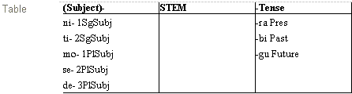

# Affix template table example

*Using Tools › Grammar tools › Category Edit*

### Example

This sample table has two slots named **Subject** and **Tense**. These and **STEM** comprise the table column headings. The optional prefix slot `Subject` has five affixes. The obligatory suffix slot `Tense` has three affixes.

> [!TIP]
>
> - Computational [parsers](../../../User_Interface/Menus/Parser/Parsing_words_overview.md) use the information in tables, including the position of slots, if they are optional or obligatory, and so on.
>
> - To [edit a template table](Edit_an_Affix_Template_Table.md), right-click a slot name or **STEM** *or* right-click an area below a column heading. This opens [context-sensitive menus](../../../Basic_Tasks/Show_data/Context_sens_menus.md) so you can do the following:
>
> - - Insert, move or remove a slot
>
>   - Change the optionality of a slot
>
>   - Add or remove inflectional affix (and open the [New Entry](../../Lexicon_tools/Lexicon_Edit/Create_a_lexical_entry.md) dialog box)
>
>   - [Show](../../../Basic_Tasks/Show_data/Show_data_overview.md) an inflectional affix in **Lexicon Edit**.
>
> - You can edit a slot name in the table heading or in the associated [Slot Name field](../../../User_Interface/Field_Descriptions/Grammar/Category_Edit_fields/name_field_slot_category_edit.md).
>
> - A sample project, called **Sena 3**, is included with each typical installation of FieldWorks. It has affix template tables you can also use as examples.

## Related topics
[Category Edit overview](Category_Edit_overview.md)

[Optional field check box](../../../User_Interface/Field_Descriptions/Grammar/Category_Edit_fields/Optional_field.md)

[Table field](../../../User_Interface/Field_Descriptions/Grammar/Category_Edit_fields/Table_field.md)
