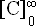

# Set occurrence

*Using Tools › Grammar tools › Phonological Rules*

In a phonological rule formula, you can right-click a natural class and select occurrence values, such as **Occurs exactly once**. You can alternatively use the **Set Occurrence** dialog box to choose specific maximum and minimum values. The maximum value is **\<infinite\>**. The minimum value is **0** (zero).

1.  In the **Phonological Rules** pane, click the desired phonological rule.

2.  In the **Phonological Rule** pane, **Rule Formula** [field](../../../User_Interface/Field_Descriptions/Grammar/Phonologocial_Rules_fields/Rule_Formula_field_(Ph_Rules).md), right-click a natural class in an environment, and then click **Set occurrence (min. and max.)**.

    The **Set Occurrence** dialog box appears.

3.  Select a different `Maximum` value and **Minimum** value, as needed.

4.  Click **OK**.

    The values set appear as superscript and subscript number or symbols on the right side of the environment.

    For example, means  this environment can occur zero or more (infinite) times.

## Related topics
[Build a phonological rule](Build_a_phonological_rule.md)

[Parsing words (Hermit Crab parser)](../../../User_Interface/Menus/Parser/Parsing_words_(HermitCrab).md)

[Phonological Rules Fields overview](../../../User_Interface/Field_Descriptions/Grammar/Phonologocial_Rules_fields/Phonological_Rules_fields_overview.md)

[Phonological Rules overview](Phonological_Rules_overview.md)
