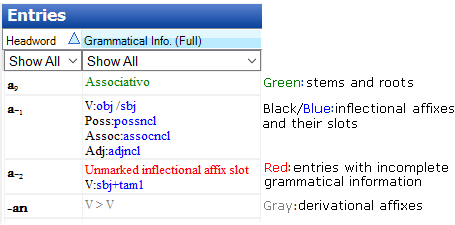

# Lexicon Browse overview

*Using Tools › Lexicon tools › Browse*

**Browse** displays lexical entries in rows and their fields in columns, like the **Entries** pane in **Lexicon Edit**. You can do any of the following in **Browse**:

- [Configure columns](../../../Basic_Tasks/Configure_Columns/Using_Configure_Columns_dialog_box.md).

- [Filter](../../../Basic_Tasks/Filtering_data/filtering_data_overview.md) and [sort](../../../Basic_Tasks/Sorting_data/Sorting_data_overview.md) data.

- [Create a lexical entry](../Lexicon_Edit/Create_a_lexical_entry.md) with shortcut keys, or menu or toolbar commands.

- *Right-click* an entry, and then

  - point to [Show concordance of](../../Texts_&_Words_tools/Concordance/specify_concordance_criteria.md) and then click **Entry** to see it in [Concordance](../../Texts_&_Words_tools/Concordance/Concordance_overview.md)

  - *s*elect **Show Entry in** **Lexicon** to see it in **Lexicon Edit**

  - *s*elect **Delete selected Entry** to [delete it](../Lexicon_Edit/Delete_a_lexical_entry.md).

- Click an entry, and then edit content in any field with an uncolored (white) background.

- Manually [change homograph numbers](Change_homograph_numbers.md).

> [!NOTE]
>
> - For a given open [window](../../../User_Interface/Menus/Window/Window_overview.md), the filtering or sorting you do in **Browse** also affects other **Edit** views. Click  on the toolbar to turn off all filters.
>
> - Colored backgrounds (not white) indicate a *non-editable* field in **Browse**.
>
> - The **Grammatical Info** columns (**Full** and **Abbr**) use different *font* colors in **Browse** and also in the **Entries** pane in **Lexicon Edit**:
>
> 
>
> - You can *select* and *copy* the data displayed in the columns, and then *paste* the data into a spreadsheet program like Microsoft Excel. The data appear in columns, just like the **Entries** pane (**Browse** or **Lexicon edit**).
>
> - - Sort and filter in **Browse** before you copy and paste the data.
>
>   - Use `Ctrl+A` to select all the data in the pane.

## Related topics
[Lexicon overview](../Lexicon_overview.md)

[Basic Tasks overview](../../../Basic_Tasks/Basic_Tasks_overview.md)
