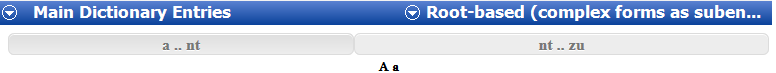
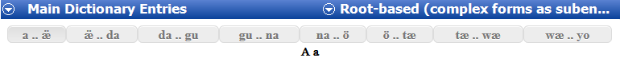

# Navigating in Dictionary

*Using Tools › Lexicon tools › Dictionary*

In **Dictionary**, a colored background marks the *entry in focus* (current entry). [Letter headings](Dictionary_Letter_Headings_overview.md) separate the lexical entries into groups based on the first letter or letters of the headwords.

If there are more than 1000 lexical entries *available* (according to the [publications)](../../../User_Interface/Field_Descriptions/Lists/Publications/What_is_a_Publication.md) and [configured](../../../User_Interface/Menus/Tools/Configure_Dictionary/Configure_Dictionary.md) for display, only the first 1000 lexical entries are displayed. In this case, tabs appear at the top and bottom of the right pane. Each tab has letters for a range of up to 1000 lexical entries.

To see more lexical entries, do any of the following:

- [Scroll](../../../User_Interface/Menus/View/Scroll_through_your_work.md) to the top, or press the **Page Up** key or the **Home** key, and then click one of the tabs that appear at the top of the pane.

- Scroll to the bottom, or press the **Page Down** key or the **End** key, and then click one of the tabs that appears at the bottom of the pane.

- Use the scroll wheel on your mouse to scroll up or down, or press the *up arrow* or *down arrow* keys.\
  If you scroll past an end (top or bottom) of the displayed entries, additional entries are added to the view. This allows you to see the context of entries that appear at an end of the range of the current tab.

- Click a *referenced headword* to jump to that lexical entry.

### Examples

- This example has *two* tabs. This project has between 1000 and 2000 lexical entries.\
  

- This example has *eight* tabs. This project has between 7000 and 8000 lexical entries.\
  

> [!TIP]
>
> - The mouse pointer changes to a hand () when it is over a referenced headword or any link you can click.
>
> - [Sort order](../../../Basic_Tasks/Sorting_data/Sorting_data_overview.md) and [filters](../../../Basic_Tasks/Filtering_data/filtering_data_overview.md) affect the order and content displayed by tab.
>
> - When you [print your dictionary](../../../User_Interface/Menus/File/Print_Dictionary_or_Reversal_Index.md), you can [print](../../../User_Interface/Menus/File/Print_content.md) the entire dictionary, one tab at a time, or only entries you select.

## Related topics
[Dictionary overview](Dictionary_overview.md)

[Referenced Headword (Configure Dictionary)](../../../User_Interface/Menus/Tools/Configure_Dictionary/Headword.md)

[Standard Toolbar](../../../User_Interface/Toolbars/Standard_toolbar.md)
