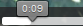

# Play a movie file in Dictionary

*Using Tools › Lexicon tools › Dictionary*

If you [inserted a movie file](../Lexicon_Edit/Insert_link_to_sound_or_movie.md) and [configured](../../../User_Interface/Menus/Tools/Configure_Dictionary/Pronunciations.md) it for display in **Dictionary**, you can play that movie file directly in **Dictionary** or in the preview pane that appears in **Lexicon Edit**.

1.  In the entry with the movie file you want to play, click the movie camera button () that appears in the entry.

    The movie opens in **Dictionary** or in the preview pane.

At the bottom there is a **Play** / **Pause** button, a scroll bar and a volume control.

2.  Do any of the following:

    - Click the **Play** button ().

The **Play** button becomes a **Pause** () button.

2.  - Drag the scroll bar bubble () to the time you want to watch.

    - Click the bars on the volume control () to change the level.

<!-- -->

3.  Press **F5** or click  on the [toolbar](../../../User_Interface/Toolbars/Standard_toolbar.md) to display the lexical entries again.

> [!TIP]
>
> - To play audio (sound only) files, click the triangle button () that appears in the entry.

## Related topics
[Dictionary overview](Dictionary_overview.md)

[Media File field](../../../User_Interface/Field_Descriptions/Lexicon/Lexicon_Edit_fields/Entry_level_fields/media_file_field.md)
