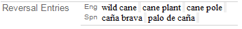
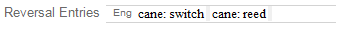
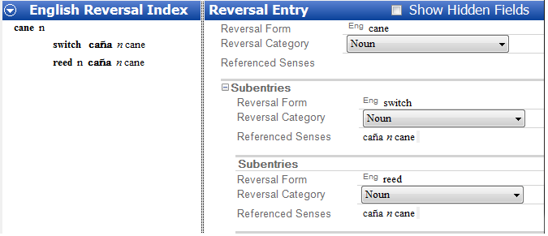

# About Reversal Entries

*Using Tools › Lexicon tools › Lexicon Edit*

A **Reversal Entries** field appears in *each lexical sense* and *subsense* in **Lexicon Edit**. It is a [single-line text field](../../../User_Interface/Field_Descriptions/Field_Types/Single_line_text_field.md) that uses analysis writing systems.

## Overview

- In **Lexicon Edit**, when you type in a **Reversal Entries** field, you type in a line for a particular analysis writing system. What you type becomes the *form* of a reversal index entry in the reversal index for that writing system.

- In **Reversal Indexes**:

  - The **Reversal Form** field displays the **Reversal Entries** field content.

Consequently, if you edit the content in the **Reversal Form** field it also changes in the **Reversal Entries** field. Similarly, if you [insert a reversal entry](../Reversal_Indexes/Insert_a_reversal_entry.md) in **Reversal Indexes** it is added to the **Reversal Entries** field for the selected sense.

1.  - The **Referenced Senses** field displays the headword, grammatical category, gloss and possibly a sense number.

    - The **Reversal Category** field allows you to choose a category for the reversal entry. It does *not* receive category information from the lexical entry. **See:** [About Reversal Index Categories](../../Lists_tools/about_reversal_index_categories.md).

## Going further

- In the **Reversal Entries** field, each writing system can have multiple reversal entries. They are separated from each other by a gray bar.

Example (for illustration only):

  - For a left-to-right analysis writing system, you can click the empty space to the right of the last gray bar and type another reversal entry.

  - For a right-to-left analysis writing system, you can click to the empty space to the left of the last gray bar and type another reversal entry.

- In the **Reversal Entries** field, you can type *both* a reversal index entry and subentry. Separate them with a colon (**:**).

Example (for illustration only):

With this example, the reversal index entry will look like this:

> [!TIP]
>
> - In **Bulk Edit Entries**, you can use **Bulk Copy** or **Click Copy** to copy glosses into the **Reversal Entries** field. **See:** [Fill in the Reversals field](../../../Lexicography_Tasks/Fill_in_the_Reversals_Field.md).
>
> - In **Bulk Edit Entries**, the **Reversals** column *is editable* when it is selected as the **Target** field in the **Bulk Copy**, **Click Copy** or **Bulk Replace** tab. This allows you to edit an existing entry or subentry (appears after a semicolon **;**).
>
> <!-- -->
>
> - **Introduction to Lexicography** also discusses reversal entries. Open it from the *Help* menu, under `Resources`.

## Related topics
[Configure Reversal Index dialog box](../../../User_Interface/Menus/Tools/Configure_Reversal_Index/Configure_Reversal_Index_dialog_box.md)

[Enter a reversal entry](Enter_a_reversal_entry.md)

[Lexicon Edit overview](lexicon_edit_overview.md)

[Reversal Indexes fields](../../../User_Interface/Field_Descriptions/Lexicon/Reversal_Indexes_fields/Reversal_Indexes_fields_overview.md)

[Reversal Indexes overview](../Reversal_Indexes/reversal_indexes_overview.md)
