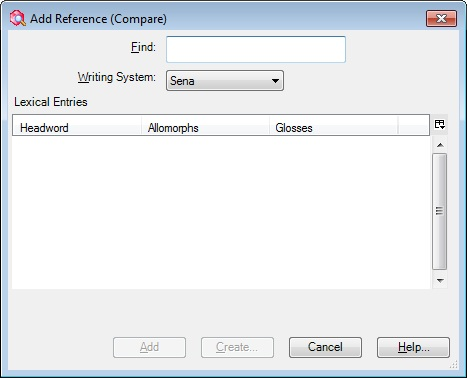
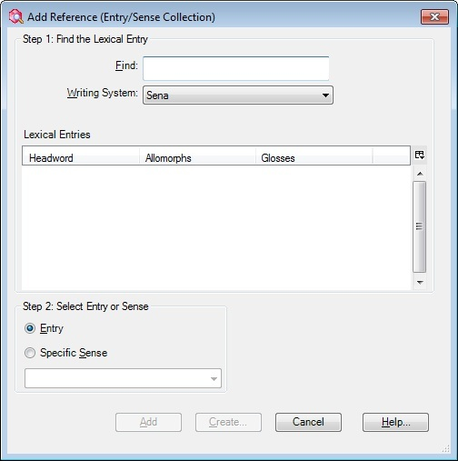
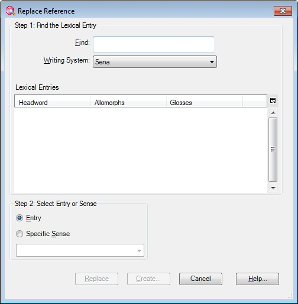

# Add Reference dialog box graphic

*Using Tools › Lexicon tools › Lexicon Edit*

Depending on the [reference set type](../../Lists_tools/About_reference_set_types.md), you will use one of the various versions of this dialog box to choose lexical entries as references for [lexical relations](../../Lists_tools/About_Lexical_Relations.md).

## Example 1

- In **Example 1**, the *reference set type* specifies either **Entry** or **Sense**, but *not* **Entry/Sense**. Consequently, it provides only the **Find** feature.

## Example 2

- In **Example** **2**, the *reference set type* specifies **Entry/Sense**. Consequently, it provides both **Find** and **Select Entry or Sense**.

## Example 3

- In **Example 3**, the *reference set type* is a *pair* (as compared to a *collection*, *tree*, *sequence*, and so on). Therefore, any existing reference can be only replaced. Consequently, the title of the dialog box is changed from **Add Reference** to **Replace Reference**.\
  Specifically, this reference set type is an **Entry/Sense Pair**, so the **Step 1** and **Step 2** features are used. If, for example, the *reference set type* was a **Sense Pair**, then the dialog box would have the features of **Example 1** above, but with the **Replace Reference** title.

## Related topics
[About Lexical Relations](../../Lists_tools/About_Lexical_Relations.md)

[About Reference set types](../../Lists_tools/About_reference_set_types.md)
