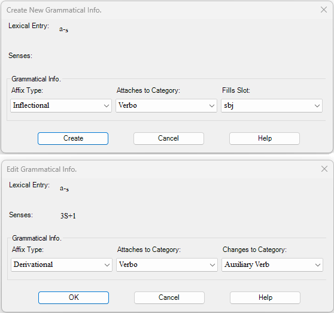

# Create New Grammatical Info dialog box graphic

*Using Tools › Lexicon tools › Lexicon Edit*

The **Create New Grammatical Info** dialog box changes depending on the **Affix Type** selected. Two variations are shown below.

## Related topics
[Use the Create New Grammatical Info Dialog box](Using_Create_New_Grammatical_Info_dialog_box.md)

[Lexicon Edit overview](lexicon_edit_overview.md)
