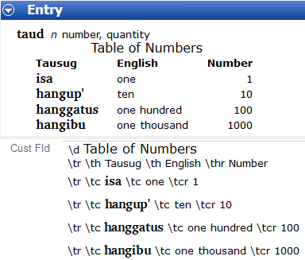

# Format a table

*Using Tools › Lexicon tools › Lexicon Edit*

You can type USFM markers in a [custom field](../../../User_Interface/Menus/Tools/Custom_Fields/Custom_Fields_overview.md) to display data in one or more tables.

<a href="https://ubsicap.github.io/usfm/titles_headings/index.html" target="_blank" title="https://ubsicap.github.io/usfm/titles_headings/index.html#">https://ubsicap.github.io/usfm/titles_headings/index.html#</a> and

<a href="https://ubsicap.github.io/usfm/tables/index.html" target="_blank" title="https://ubsicap.github.io/usfm/tables/index.html">https://ubsicap.github.io/usfm/tables/index.html</a> describe these and more:

<table data-bgcolor="#E8E8E8" data-border="1" data-cellspacing="0" style="border-collapse: separate; border-collapse: separate;" width="95%">
<tbody>
<tr>
<td>
Marker
</td>
<td>
Contents
</td>
</tr>
<tr>
<td data-bgcolor="#FFFFFF">
\d
</td>
<td data-bgcolor="#FFFFFF">
descriptive title - centered
</td>
</tr>
<tr>
<td data-bgcolor="#FFFFFF">
\tr
</td>
<td data-bgcolor="#FFFFFF">
table row start
</td>
</tr>
<tr>
<td data-bgcolor="#FFFFFF">
\th#
</td>
<td data-bgcolor="#FFFFFF">
table header - centered and bold
</td>
</tr>
<tr>
<td data-bgcolor="#FFFFFF">
\thl#
</td>
<td data-bgcolor="#FFFFFF">
left-aligned and bold
</td>
</tr>
<tr>
<td data-bgcolor="#FFFFFF">
\thr#
</td>
<td data-bgcolor="#FFFFFF">
right-aligned and bold
</td>
</tr>
<tr>
<td data-bgcolor="#FFFFFF">
\tc#
</td>
<td data-bgcolor="#FFFFFF">
table cell - left-aligned
</td>
</tr>
<tr style="height: 0px;">
<td data-bgcolor="#FFFFFF">
\tcc#
</td>
<td data-bgcolor="#FFFFFF">
centered
</td>
</tr>
<tr style="height: 0px;">
<td data-bgcolor="#FFFFFF">
\tcr#
</td>
<td data-bgcolor="#FFFFFF">
right-aligned
</td>
</tr>
<tr style="height: 0px;">
<td colspan="2" data-bgcolor="#FFFFFF">
<strong>Note:</strong> # is the table column number, which is optional.

\tc#-# and \th#-# allow a cell to span more than one column.
</td>
</tr>
<tr style="height: 0px;">
<td colspan="2" data-bgcolor="#FFFFFF">
 <strong>Example</strong> (left-to-right dictionary):

<h3 id="section"></h3>
<ul>
<li>You can select particular words and then <a href="../../../User_Interface/Menus/Format/select_a_writing_system.md">select a writing system</a> or <a href="../../../User_Interface/Toolbars/Format_toolbar.md">style</a> for them. 
In this example, a custom character style was <a href="../../../User_Interface/Menus/Format/apply_a_style_to_text.md">applied</a> to Table of Numbers.</li>
<li>For a right-to-left dictionary, type the markers in reverse order: 
d\ 
3thr\ 2th\ 1th\ tr\ 
3tcr\ 2tc\ 1tc\ tr\</li>
</ul></td>
</tr>
</tbody>
</table>

Do these steps:

1.  [Add](../../../User_Interface/Menus/Tools/Custom_Fields/add_a_custom_field.md) a custom field with the [type](../../../User_Interface/Field_Descriptions/Field_Types/field_types_overview.md) *single-line text.*\
    You can add it at either the entry level or sense level.\
    You must choose either First Vernacular Writing System or First Analysis Writing System.

2.  In the **Navigation** **Pane**, click **Lexicon**, and then click **Lexicon Edit**.

3.  In the **Entries** pane, click the desired entry.

4.  Click the custom field, and then do these steps:

    - Type \d or \tr so FLEx will interpret the data as belonging in a table. Then type another marker and the contents.

    - Press the `Shift` key and then press **Enter** to add another line in the field.

    - Type another marker and then type the contents.

    - Repeat these steps until your table is complete.

> [!NOTE]
>
> - You can have more than one table in a field if you use another \d.
>
> - Advanced users can change the [ProjectDictionaryOverrides.css](../../../Advanced_Tasks/Custom_CSS_Override_Files/Custom_CSS_Override_Files_overview.md) to customize the ways it looks. You might need to [Get More Help](../../../Overview/Technical_support.md).
>
> - As the example above shows, tables can appear in [Dictionary](../Dictionary/Dictionary_overview.md).

## Related topics
[Entry level fields](../../../User_Interface/Field_Descriptions/Lexicon/Lexicon_Edit_fields/Entry_level_fields/Entry_level_fields_overview.md) / [Sense level fields](../../../User_Interface/Field_Descriptions/Lexicon/Lexicon_Edit_fields/Sense_level_fields/Sense_level_fields_overview.md)

[Lexicon Edit overview](lexicon_edit_overview.md)
