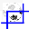

# Using Picture Properties dialog box

*Using Tools › Lexicon tools › Lexicon Edit*

You use this dialog box when you [insert a picture](Insert_a_picture.md), or want to crop an existing picture.

##  Get Picture

- Click the source:  **Image Galleries**,  **Scanner**,  **Camera** or  **File**.

- 1.  For **Image Galleries**, do either of these steps:

  <!-- -->

  1.  - If *Art Of Reading* version 3.1 (or later) is installed and you have the appropriate keyboard, you can type a word in the **Image Gallery** search box in other languages. Click the down-arrow () that is next to the search box, and then click the desired language. Type the word that describes the picture you want to find.

      - For older versions of *Art of Reading*, in the search box, type an English word that describes the picture you want to find.

  <!-- -->

  2.  Click the search button ().

  3.  Click the picture you want to use. Click **OK**.

- For **Scanner**, **Camera** or **File**, do the necessary steps to find the picture. Each situation might be different, so are beyond the scope of these FLEx Help instructions.

##  Crop

1.  Do the steps above to get the picture you want to [insert,](Insert_a_picture.md) or click an existing picture in the **Picture** [field](../../../User_Interface/Field_Descriptions/Lexicon/Lexicon_Edit_fields/Sense_level_fields/Picture_field.md) or **Thumbnail** [field](../../../User_Interface/Field_Descriptions/Lexicon/Lexicon_Edit_fields/Sense_level_fields/Thumbnail_field.md) to display a picture in the **Picture Properties** dialog box.

2.  Click  **Crop**.

Notice that dark rectangles appear at each edge of the picture.

Do this for each edge:

  - Click a rectangle and drag it to remove the unwanted part from that edge.

Release the mouse button. Look at the picture on the right to see the result.

3.  Click **OK** if you are done using this dialog box.

## Metadata

1.  You might see existing metadata that you cannot change.

Otherwise, click a link that appears. You might see any of these links: **Set up metadata** *or* **Edit** *or* **Use**.

- Then [use](Using_Credit_Copyright_License_dialog_box.md) the **Credit**, **Copyright and License** dialog box.

Other links may appear. Some open Internet sites if you have an Internet connection.

2.  Click **OK**.

## Related topics
[Lexicon Edit overview](lexicon_edit_overview.md)

## Related links
<https://creativecommons.org/licenses/by-nc/4.0/legalcode#s1i>

<a href="http://www.techterms.com/definition/crop" target="_blank" title="http://www.techterms.com/definition/crop">https://www.techterms.com/definition/crop</a>
