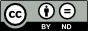
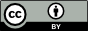
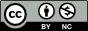
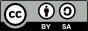
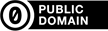

# Using Credit, Copyright and License dialog box

*Using Tools › Lexicon tools › Lexicon Edit*

When you [insert a picture](Insert_a_picture.md) or work with picture metadata, do the steps below in this dialog box:

1.  **Creator** - Type the full name of the illustrator or photographer.

2.  **Copyright Year** - Type the year that the picture was copyrighted.

3.  **Copyright Holder** - Type the name of the copyright holder.

4.  **License**

Select () *one* of these options:

- **Creative Commons**

Click the <a href="https://creativecommons.org/licenses/by-nc/4.0/legalcode#s1i" target="_blank" title="https://creativecommons.org/licenses/by-nc/4.0/legalcode#s1i">more info</a> link to read about this on the Internet, in necessary.

Select () **Yes** or **No** to answer the questions.

If you will select () **Intergovernmental Version**, see: <a href="https://creativecommons.org/licenses/by/3.0/igo/" target="_blank" title="https://creativecommons.org/licenses/by/3.0/igo/">Attribution 3.0 IGO</a>.

**Additional Requests** is a place where you can type more text to grant additional permissions or clarify your intentions. What you type will appear below your Creative Commons symbol, but it is *not* enforceable. Click the <a href="https://creativecommons.org/licenses/by-nc/4.0/legalcode#s7a" target="_blank" title="https://creativecommons.org/licenses/by-nc/4.0/legalcode#s7a">Not Enforceable</a> link to read about it on the internet.

- **The copyright holder waives all rights**

Click the <a href="https://creativecommons.org/publicdomain/zero/1.0/" target="_blank" title="https://creativecommons.org/publicdomain/zero/1.0/">about CC0 Public Domain</a> link to read about this option.

- **Contact the copyright holder for any permissions**

You see **All rights reserved** as the license statement.

- **Custom**

Type your custom license in the box.

5.  Click **OK**.

> [!TIP]
>
> - You can [configure](../../../User_Interface/Menus/Tools/Configure_Dictionary/Configure_Dictionary.md) your [pictures](../../../User_Interface/Menus/Tools/Configure_Dictionary/Pictures.md) in **Dictionary** to include the **Creator** and **Copyright/License** metadata.
>
> - Your **Creative Commons** selections determine how *your* symbol will appear in this dialog box and the **Picture Properties** [dialog box](Use_the_Picture_Properties_dialog_box.md).
>
> Here are some examples:
>
>     
>
> In the **Dictionary** [view](../Dictionary/Dictionary_overview.md), you would see cc-by-nd, cc-by, cc-by-nc, cc-by-sa or cc0 and so on.

## Related topics
[Lexicon Edit overview](lexicon_edit_overview.md)

## Related links
<a href="https://creativecommons.org/licenses/by-nc/4.0/legalcode" target="_blank" title="https://creativecommons.org/licenses/by-nc/4.0/legalcode">https://creativecommons.org/licenses/by-nc/4.0/legalcode</a>

<a href="https://creativecommons.org/licenses/by/3.0/igo/" target="_blank" title="https://creativecommons.org/licenses/by/3.0/igo/">https://creativecommons.org/licenses/by/3.0/igo/</a>

<a href="https://creativecommons.org/publicdomain/zero/1.0/" target="_blank" title="https://creativecommons.org/publicdomain/zero/1.0/">https://creativecommons.org/publicdomain/zero/1.0/</a>
