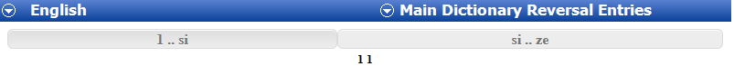
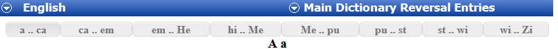

# Navigating in Reversal Indexes

*Using Tools › Lexicon tools › Reversal Indexes*

In **Reversal Indexes**, a colored background marks the reversal entry that is *in focus* (current entry). Letter headings separate the reversal entries into groups based on the first letter or letters of the reversal headwords.

If there are more than 1000 reversal entries *available* (according to the [publications)](../../../User_Interface/Field_Descriptions/Lists/Publications/What_is_a_Publication.md) and [configured](../../../User_Interface/Menus/Tools/Configure_Reversal_Index/Configure_Reversal_Index_dialog_box.md) for display, only the first 1000 reversal entries are displayed. In this case, tabs appear at the top and bottom of the center pane. Each tab has letters for a range of up to 1000 reversal entries.

To see more reversal entries, do any of the following:

- [Scroll](../../../User_Interface/Menus/View/Scroll_through_your_work.md) to the top of the center pane, or press the **Page Up** or **Home** key, and then click one of the tabs that appear at the top of the pane.

- Scroll to the bottom of the center pane, or press the **Page Down** or **End** key, and then click one of the tabs that appears at the bottom of the pane.

- Use the scroll wheel on your mouse to scroll up or down, or press the *up arrow* or *down arrow* keys.\
  If you scroll past an end (top or bottom) of the displayed entries, additional entries are added to the display. This allows you to see the context of entries that appear at an end of the range of the current tab.

- Click a *referenced headword* to jump to that lexical entry.

### Examples

- This example has *two* tabs. This project has between 1000 and 2000 reversal entries.\
  

- This example has *eight* tabs. This project has between 7000 and 8000 reversal entries.\
  

> [!TIP]
>
> - The mouse pointer changes to a hand () when it is over a referenced headword or any link you can click.
>
> - [Sort order](../../../Basic_Tasks/Sorting_data/Sorting_data_overview.md) and [filters](../../../Basic_Tasks/Filtering_data/filtering_data_overview.md) affect the order and content displayed by tabs.
>
> - When you [print your reversal index](../../../User_Interface/Menus/File/Print_Dictionary_or_Reversal_Index.md), you can [print](../../../User_Interface/Menus/File/Print_content.md) the entire dictionary, one tab at a time, or only entries you select.

## Related topics
[Referenced Headword - Primary Entry References](../../../User_Interface/Menus/Tools/Configure_Reversal_Index/Referenced_Headword%2c_Primary_Entry_References.md)

[Referenced Headword - References Senses](../../../User_Interface/Menus/Tools/Configure_Reversal_Index/Referenced_Headword_Referenced_Senses.md)

[Reversal Indexes overview](reversal_indexes_overview.md)

[Standard Toolbar](../../../User_Interface/Toolbars/Standard_toolbar.md)
