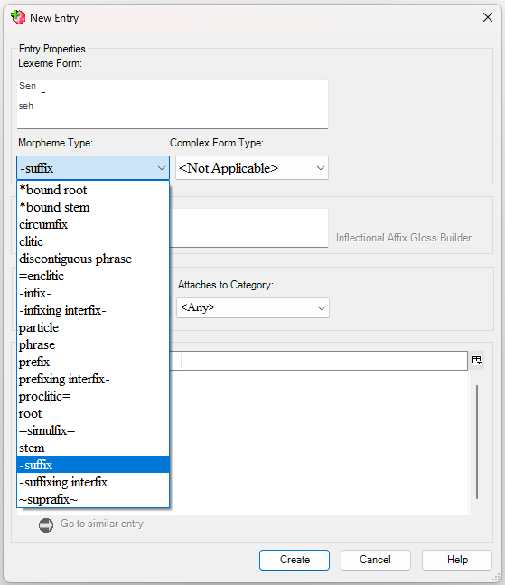

# About Morpheme Types

*Using Tools › Lists tools*

A *morpheme type* is a category based upon how a morpheme combines with other morphemes to form a word. Suffix, prefix, root, stem, particle and phrase are *some* of the kinds of morpheme types that Language Explorer uses. You can [edit](Edit_a_list_item_or_subitem.md) a morpheme type, but you cannot create a new one. [Secondary order](Change_the_secondary_sort_order.md) of similar entries is controlled by way of morpheme types.

Content from the **Name**, **Abbreviation**, **Leading Token** and **Trailing Token** fields appear in various [fields](../../User_Interface/Field_Descriptions/field_descriptions_overview.md) and dialog boxes.

- For example, the [leading token](../../User_Interface/Field_Descriptions/Lists/Morpheme_Types_fields/leading_token_field_morpheme_types.md), [name](../../User_Interface/Field_Descriptions/Lists/Morpheme_Types_fields/Name_field_Morpheme_Types.md) and [trailing token](../../User_Interface/Field_Descriptions/Lists/Morpheme_Types_fields/trailing_token_field_morpheme_types.md) are displayed (as applicable) in the **New Entry** dialog box **Morpheme Type** list:

> [!TIP]
>
> - For more information, on the [Help](../../User_Interface/Menus/Help/Help_overview.md) menu point to **Resources**, and then click **Introduction to Parsing**. Section 4 includes a discussion about morpheme types that are significant to the [parsers](../../User_Interface/Menus/Parser/Parsing_words_overview.md).

## Related topics
[Change the morph type](../Lexicon_tools/Lexicon_Edit/change_the_morph_type.md)

[Change the tokens for morpheme types](Change_the_tokens_for_morpheme_types.md)

[Create a lexical entry](../Lexicon_tools/Lexicon_Edit/Create_a_lexical_entry.md)

[Bulk change the morph type](../../Lexicography_Tasks/bulk_change_the_morph_type.md)

[Lists overview](Lists_overview.md)

[Morpheme Types fields](../../User_Interface/Field_Descriptions/Lists/Morpheme_Types_fields/Morpheme_Types_fields_overview.md)
