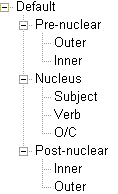

# Default Text Chart columns

*Using Tools › Lists tools › Text Chart lists*

The **Text Chart** tab appears in the **Texts** **&** **Words** area, but the chart columns are stored in templates in the **Lists** area.

### The Default template:

<table width="100%">
<tbody>
<tr style="height: 0px;">
<td style="width: 14.496%">

</td>
<td style="width: 85.504%">
Templates are limited to <em>three</em> hierarchical levels:

<ul>
<li>
<em>Template names</em>, here <strong>Default</strong>, are at the first level (see  <strong>Important </strong>below).
</li>
<li><ul>
<li>
<em>Column groups</em> (or "groups") are at the second level. <strong>Pre-nuclear</strong>, <strong>Nucleus</strong> and <strong>Post-nuclear</strong> are the default groups.
</li>
<li><ul>
<li>
<em>Columns</em> (header <a href="../../../User_Interface/Field_Descriptions/Lists/Text_Chart_Temp_fields/name_field_tctemp.md">labels</a>) you see in the <strong>Text Chart</strong> tab are at the third level. <strong>Subject-Verb-Object</strong> (<strong>SVO</strong>) is the default column order in the <strong>Nucleus</strong> group.
</li>
</ul></li>
</ul></li>
</ul></td>
</tr>
</tbody>
</table>

### Suggested content for the Default template columns

- **Outer**: Preposed elements, nouns of direct address and interjections.

- **Inner**: Conjunctions, questions words, one-word Points of Departure, and pointers to "preceding" clauses (dependent, speech or song).

- **Subject**: Demonstratives, pronouns, nouns, noun phrases (which can include adjectives and associative phrases). Three dashes (**----**) are automatically added as a placeholder for material understood to be the subject but which is not specified.

- **Verb**: Verbs, verb phrases (which include compound verb and adverbial auxiliaries) and occasionally adverbs.

- **Object/Complement**: One or more demonstratives, pronouns, nouns, noun phrases (which can include adjectives and associative phrases).

- **Inner**: Locative phrases, conjunctive phrases (such as: and, or, like).

- **Outer**: Ideophones, interjections, conjunctions, complement introducers, quote introducers, relative markers and pointers to "following" clauses (dependent, speech or song).

- **Notes** is an editable text column. You can type notation or comments about the clause in that row.

> [!IMPORTANT]
>
> - You can [add](Add_a_new_Text_Constituent_Chart_Template.md) a new **Text Constituent Chart Template** or you can [change](specify_columns_for_chart.md) the **Default** template to make it appropriate for your language project.
>
> - - If you want to change the template, for example for use with a **SOV** language, you need to do it *before* the columns have any content or [delete](../../Texts_&_Words_tools/Interlinear_Texts/Text_Chart_tab/clear_chart_from.md) the data from all charts.
>
>   - [Back up](../../../User_Interface/Menus/File/Backup_and_Restore/Back_up_this_Project.md) your language project *before* you change the template. FieldWorks prohibits changes that put the integrity of your chart at risk and displays a warning message. *However*, if a change is permitted by FieldWorks, but negatively impact your charts, you may need to restore the language project.
>
> <!-- -->
>
> - For *right-to-left* writing systems, the **Text Chart** tab presents the columns in the reverse order, so you do not need to manually change them here.

## Related topics
[Lists overview](../Lists_overview.md)

[Specify columns for Text Chart tab](specify_columns_for_chart.md)

[Text Chart Markers fields overview](../../../User_Interface/Field_Descriptions/Lists/Text_Chart_Markers_fields/Text_Chart_Markers_fields_overview.md)

[Text Chart overview](../../Texts_%26_Words_tools/Interlinear_Texts/Text_Chart_tab/Text_chart_overview.md)

[Text Constituent Chart Templates fields overview](../../../User_Interface/Field_Descriptions/Lists/Text_Chart_Temp_fields/Text_Chart_Temp_flds_overview.md)
